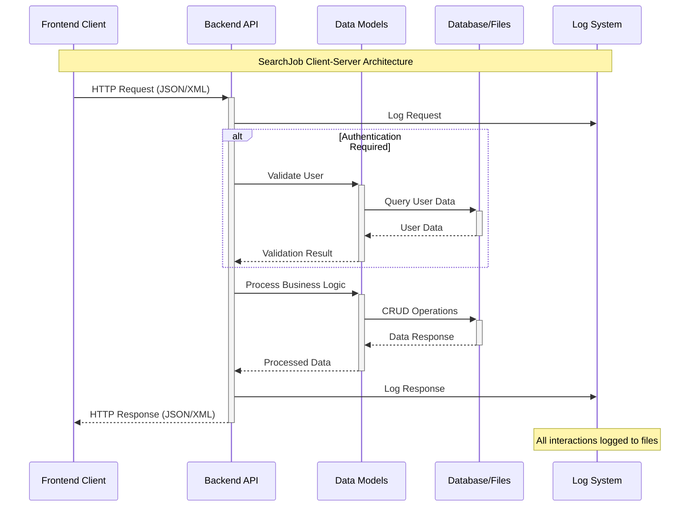

# Лабораторна робота 2: Архітектура програмного забезпечення та клієнт-серверна взаємодія

## Мета роботи
Формування та реалізація клієнт-серверної архітектури додатку на основі ідеї та інфраструктури проекту SearchJob, сформованої в результаті виконання попередньої роботи.

## Реалізовані теми та техніки

### 1. Клієнт-серверна архітектура додатків
У проекті SearchJob реалізовано трирівневу клієнт-серверну архітектуру з наступними компонентами:

#### Рівні архітектури:
1. Presentation Layer (Рівень презентації)
   - Frontend частина: `d:\Сервер\project\webroot\searhjob\frontend\`
   - HTML/CSS/JavaScript інтерфейс користувача
   - Відображення форм, списків вакансій, профілів

2. Application Layer (Прикладний рівень)
   - Backend контролери: `d:\Сервер\project\webroot\searhjob\backend\controllers\`
   - API ендпоінти для обробки запитів
   - Бізнес-логіка додатку

3. Data Access Layer (Рівень доступу до даних)
   - Моделі даних: `d:\Сервер\project\webroot\searhjob\backend\models\`
   - Робота з базою даних MySQL
   - Зберігання користувачів, вакансій, заявок

#### Тип клієнта: Тонкий клієнт
- Сервер перевіряє всі дані клієнта перед формуванням запитів до бази даних
- Валідація даних відбувається на серверній стороні
- Забезпечує захист від шахрайства на рівні 80-90%

### 2. Протоколи взаємодії
Проект використовує HTTP протокол для клієнт-серверної взаємодії:
- Висока надійність передачі даних
- Стандартизовані методи: GET, POST, PUT, DELETE
- Підтримка JSON та XML форматів даних

## UML-диаграма клієнт-серверної взаємодії



### Основні компоненти взаємодії:

1. Frontend Client
   - Веб-браузер користувача
   - JavaScript для AJAX запитів
   - Форми для введення даних

2. Backend API
   - `ApiController.php` - основний API контролер
   - `XmlApiController.php` - XML API контролер  
   - `VacancyApiController.php` - API для роботи з вакансіями

3. Data Models
   - `User.php` - модель користувача
   - `Vacancy.php` - модель вакансії
   - `JobApplication.php` - модель заявки на роботу

4. Database/Storage
   - MySQL база даних
   - XML файли для сериалізації
   - Файлове сховище логів

## Сериалізація та десериалізація повідомлень

### 1. JSON Сериалізація
Основний формат обміну даними між клієнтом та сервером:

#### Приклад JSON запиту (реєстрація користувача):
```json
{
    "login": "john_doe",
    "password": "secure_password",
    "email": "john@example.com",
    "role": "job_seeker"
}
```

#### Приклад JSON відповіді:
```json
{
    "success": true,
    "message": "Користувач успішно зареєстрований",
    "data": {
        "user_id": 15,
        "login": "john_doe",
        "role": "job_seeker"
    }
}
```

#### Реалізація в коді:
```php
// Десериалізація JSON запиту
$data = json_decode(file_get_contents('php://input'), true);

// Сериалізація JSON відповіді
echo json_encode([
    'success' => true,
    'data' => $result
], JSON_UNESCAPED_UNICODE);
```

### 2. XML Сериалізація
Альтернативний формат для зберігання та обміну даними:

#### Приклад XML відповіді (інформація про користувача):
```xml
<?xml version="1.0" encoding="UTF-8"?>
<response>
    <success>true</success>
    <data>
        <user>
            <id>1</id>
            <login>admin</login>
            <email>admin@jobsearch.com</email>
            <role>admin</role>
            <created_at>2025-06-05 12:00:00</created_at>
        </user>
    </data>
</response>
```

#### Реалізація XML сериалізації в `XmlApiController.php`:
```php
function arrayToXml($data, $xml, $parentNode) {
    foreach ($data as $key => $value) {
        if (is_array($value)) {
            $child = $xml->createElement($key);
            $parentNode->appendChild($child);
            arrayToXml($value, $xml, $child);
        } else {
            $child = $xml->createElement($key, htmlspecialchars($value));
            $parentNode->appendChild($child);
        }
    }
}
```

### 3. Переваги сериалізації в проекті:
- Стандартизація: Уніфікований формат обміну даними
- Сумісність: JSON підтримується всіма сучасними браузерами
- Читабельність: XML формат зручний для налагодження
- Розширюваність: Легко додавати нові поля без порушення сумісності

## Логування на стороні серверу

### 1. Система логування
Проект реалізує комплексну систему логування всіх повідомлень між клієнтом та сервером:

#### Основні компоненти:
- ApiLogController.php - базове логування API запитів
- Logger.php - розширена система логування
- Файли логів - збереження в директорії `backend/logs/`

### 2. Формат логування: JSON
Обраний JSON формат для логування забезпечує:
- Структурованість даних
- Легкість парсингу
- Компактність
- Зручність аналізу

#### Приклад запису в лог файлі:
```json
2025-06-05 14:30:15 {
    "request": "/searhjob/backend/api.php?action=register",
    "method": "POST",
    "headers": {
        "Content-Type": "application/json",
        "User-Agent": "Mozilla/5.0..."
    },
    "body": "{\"login\":\"test_user\",\"password\":\"password123\",\"email\":\"test@example.com\"}",
    "timestamp": "2025-06-05 14:30:15",
    "response_time": 0.023,
    "status_code": 200
}
```

### 3. Типи логування

#### a) API Логування (`ApiLogController.php`):
```php
function log_api($data) {
    global $logFile;
    $entry = date('Y-m-d H:i:s') . ' ' . json_encode($data, JSON_UNESCAPED_UNICODE) . "\n";
    file_put_contents($logFile, $entry, FILE_APPEND);
}

// Використання:
log_api([
    'request' => $_SERVER['REQUEST_URI'],
    'method' => $_SERVER['REQUEST_METHOD'],
    'headers' => getRequestHeaders(),
    'body' => file_get_contents('php://input')
]);
```

#### b) Розширене логування (`Logger.php`):
```php
class Logger {
    public static function api($message, $context = []) {
        self::writeLog('api', $message, $context);
    }
    
    public static function error($message, $context = []) {
        self::writeLog('error', $message, $context);
    }
    
    private static function writeLog($level, $message, $context = []) {
        $logEntry = [
            'timestamp' => date('Y-m-d H:i:s'),
            'level' => $level,
            'message' => $message,
            'context' => $context,
            'memory_usage' => memory_get_usage(true),
            'peak_memory' => memory_get_peak_usage(true)
        ];
        
        $logFile = self::$logDir . "/{$level}.log";
        file_put_contents($logFile, json_encode($logEntry, JSON_UNESCAPED_UNICODE) . "\n", FILE_APPEND);
    }
}
```

### 4. Структура файлів логування:
```
backend/logs/
├── api.log          # Всі API запити та відповіді
├── error.log        # Помилки системи
├── info.log         # Загальна інформація
├── debug.log        # Налагоджувальна інформація
└── database.log     # Запити до бази даних
```

### 5. Переваги системи логування:
- Повнота: Реєструються всі взаємодії клієнт-сервер
- Структурованість: JSON формат дозволяє легко аналізувати логи
- Масштабованість: Різні типи логів в окремих файлах
- Налагодження: Детальна інформація для вирішення проблем
- Аудит: Можливість відстеження всіх дій користувачів

## Технічна реалізація

### 1. Файлова структура проекту:
```
searhjob/
├── backend/                 # Серверна частина
│   ├── controllers/         # API контролери
│   │   ├── ApiController.php
│   │   ├── ApiLogController.php
│   │   ├── XmlApiController.php
│   │   └── VacancyApiController.php
│   ├── models/             # Моделі даних
│   │   ├── User.php
│   │   ├── Vacancy.php
│   │   └── JobApplication.php
│   ├── utils/              # Утиліти
│   │   └── Logger.php
│   ├── logs/               # Файли логів
│   └── xml/                # XML файли для сериалізації
├── frontend/               # Клієнтська частина
│   ├── controllers/        # Frontend контролери
│   ├── views/              # Шаблони сторінок
│   ├── utils/              # Утиліти клієнта
│   │   └── InternalApiClient.php
│   └── assets/             # Статичні ресурси
```

### 2. Основні API ендпоінти:
- `POST /api.php?action=register` - Реєстрація користувача
- `POST /api.php?action=login` - Авторизація
- `GET /api.php?action=profile` - Отримання профілю
- `POST /vacancy_api.php?action=create` - Створення вакансії
- `GET /vacancy_api.php?action=list` - Список вакансій
- `POST /vacancy_api.php?action=apply` - Подача заявки

## Висновки

Проект SearchJob успішно реалізує сучасну клієнт-серверну архітектуру з наступними особливостями:

1. Архітектурний патерн: Трирівнева клієнт-серверна архітектура з тонким клієнтом
2. Протокол взаємодії: HTTP з підтримкою RESTful API принципів
3. Сериалізація даних: JSON для основної взаємодії, XML для спеціальних випадків
4. Логування: Комплексна система з JSON форматом для зберігання всіх взаємодій
5. Безпека: Валідація даних на серверній стороні, захист від CORS атак

Реалізована архітектура забезпечує:
- Високу масштабованість системи
- Надійність передачі даних
- Зручність налагодження та аналізу
- Можливість легкого розширення функціональності
- Ефективну взаємодію між клієнтом та сервером

Система логування дозволяє відстежувати всі операції, що критично важливо для платформи пошуку роботи, де необхідно контролювати взаємодії між роботодавцями та шукачами роботи.
