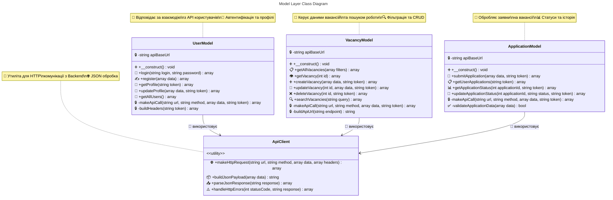
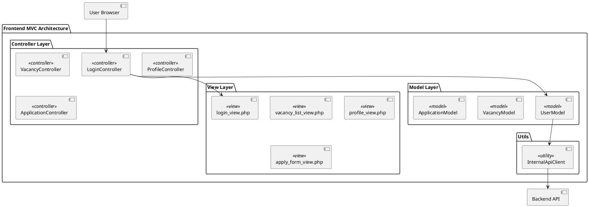

# Лабораторна робота 3: Архітектура клієнтської частини

## Мета роботи
Дослідження та реалізація найбільш поширених архітектур, які використовуються для організації роботи клієнтської частини у клієнт-серверних програмних засобах.

## Реалізовані теми та техніки

### 1. Клієнтська архітектура додатків
У проекті SearchJob реалізовано архітектурний патерн MVC (Model-View-Controller) для організації клієнтської частини.

### 2. Технічний опис архітектури клієнтської частини

#### Обраний патерн: Model-View-Controller (MVC)

Обґрунтування вибору:
- Простота розгортання та реалізації
- Поширеність та зручність адаптації нових спеціалістів
- Можливість паралельної реалізації компонентів
- Універсальність через можливість легкої заміни технології розробки GUI
- Відповідність природі веб-додатків з PHP backend

### 3. Структура MVC патерну в SearchJob

#### Model (Модель) - Рівень даних та бізнес-логіки
Відповідає за:
- Взаємодію з backend API
- Обробку даних користувачів
- Управління станом даних
- Валідацію на клієнтській стороні

Реалізовані моделі:
- `UserModel.php` - робота з користувачами
- `VacancyModel.php` - робота з вакансіями  
- `ApplicationModel.php` - робота із заявками

#### View (Представлення) - Рівень інтерфейсу користувача
Відповідає за:
- Відображення інтерфейсу користувача
- Рендеринг HTML сторінок
- Презентацію даних
- Взаємодію з користувачем

Реалізовані представлення:
- `login_view.php` - форма авторизації
- `vacancy_list_view.php` - список вакансій
- `profile_view.php` - профіль користувача
- `apply_form_view.php` - форма подачі заявки

#### Controller (Контролер) - Рівень управління та бізнес-логіки
Відповідає за:
- Обробку HTTP запитів
- Координацію між Model та View
- Управління потоком додатку
- Авторизацію та безпеку

Реалізовані контролери:
- `LoginController.php` - авторизація
- `VacancyController.php` - робота з вакансіями
- `ProfileController.php` - управління профілем
- `RegisterController.php` - реєстрація
- `ApplicationController.php` - подача заявок

## UML-діаграми архітектури

### 1. UML-діаграма компонентів клієнтської частини

```mermaid
---
title: Frontend MVC Architecture Components
---
flowchart TB
    subgraph Frontend["🎨 Frontend MVC Architecture"]
        subgraph ViewLayer["📱 View Layer"]
            LV["login_view.php<br/>🔐 Форма входу"]
            VLV["vacancy_list_view.php<br/>📋 Список вакансій"]
            PV["profile_view.php<br/>👤 Профіль користувача"]
            AFV["apply_form_view.php<br/>📝 Форма заявки"]
            RV["register_view.php<br/>✍️ Реєстрація"]
        end
        
        subgraph ControllerLayer["🎯 Controller Layer"] 
            LC["LoginController<br/>🔑 Авторизація"]
            VC["VacancyController<br/>💼 Управління вакансіями"]
            PC["ProfileController<br/>👤 Профіль"]
            RC["RegisterController<br/>✍️ Реєстрація"]
            AC["ApplicationController<br/>📋 Заявки"]
        end
        
        subgraph ModelLayer["💾 Model Layer"]
            UM["UserModel<br/>👥 Дані користувачів"]
            VM["VacancyModel<br/>💼 Дані вакансій"]
            AM["ApplicationModel<br/>📄 Дані заявок"]
        end
        
        subgraph UtilsLayer["🔧 Utils Layer"]
            IAC["InternalApiClient<br/>🌐 API клієнт"]
        end
    end
    
    subgraph Backend["🖥️ Backend API"]
        API["Backend Controllers<br/>⚡ REST API"]
    end
    
    subgraph External["🌍 External Interface"]
        USER["👤 User Browser<br/>🌐 Веб-браузер"]
    end
    
    %% User interactions
    USER -.->|HTTP Request| LC
    USER -.->|HTTP Request| VC
    USER -.->|HTTP Request| PC
    USER -.->|HTTP Request| RC
    USER -.->|HTTP Request| AC
    
    %% Controller to View responses
    LC -->|Render| LV
    VC -->|Render| VLV
    PC -->|Render| PV
    RC -->|Render| RV
    AC -->|Render| AFV
    
    %% Controller to Model interactions
    LC -.->|Data Request| UM
    VC -.->|Data Request| VM
    PC -.->|Data Request| UM
    RC -.->|Data Request| UM
    AC -.->|Data Request| AM
    
    %% Model to API interactions
    UM -->|API Call| IAC
    VM -->|API Call| IAC
    AM -->|API Call| IAC
    IAC ===|HTTP/JSON| API
    
    %% Styling for GitHub compatibility
    classDef viewStyle fill:#E3F2FD,stroke:#1976D2,stroke-width:2px,color:#000
    classDef controllerStyle fill:#F3E5F5,stroke:#7B1FA2,stroke-width:2px,color:#000
    classDef modelStyle fill:#E8F5E8,stroke:#388E3C,stroke-width:2px,color:#000
    classDef utilStyle fill:#FFF3E0,stroke:#F57C00,stroke-width:2px,color:#000
    classDef backendStyle fill:#FFEBEE,stroke:#D32F2F,stroke-width:2px,color:#000
    classDef userStyle fill:#E8EAF6,stroke:#3F51B5,stroke-width:2px,color:#000
    
    class LV,VLV,PV,AFV,RV viewStyle
    class LC,VC,PC,RC,AC controllerStyle
    class UM,VM,AM modelStyle
    class IAC utilStyle
    class API backendStyle
    class USER userStyle
```

### 2. UML-діаграма класів для рівня Model



### 3. UML-діаграма класів для рівня Controller

```mermaid
---
title: Controller Layer Class Hierarchy
---
classDiagram
    class BaseController {
        &lt;&lt;abstract&gt;&gt;
        🛡️ #render(string view, array data) void
        🔄 #redirect(string url) void
        🔐 #isAuthenticated() bool
        ⚠️ #requireAuth() void
        👤 #getCurrentUser() array
        ❌ #handleError(string message) void
    }
    
    class LoginController {
        🔒 -UserModel userModel
        ➕ +__construct() void
        🏠 +index() void
        🔑 +authenticate() void
        🚪 +logout() void
        ✅ -validateCredentials(string login, string password) bool
        💾 -setUserSession(array userData) void
    }
    
    class VacancyController {
        🔒 -VacancyModel vacancyModel
        ➕ +__construct() void
        📋 +index() void
        👁️ +show(int id) void
        ➕ +create() void
        💾 +store() void
        ✏️ +edit(int id) void
        🔄 +update(int id) void
        ❌ +delete(int id) void
        ✅ -validateVacancyData(array data) bool
        🔒 -checkOwnership(int vacancyId) bool
    }
    
    class ProfileController {
        🔒 -UserModel userModel
        ➕ +__construct() void
        🏠 +index() void
        ✏️ +edit() void
        🔄 +update() void
        📸 +uploadAvatar() void
        ✅ -validateProfileData(array data) bool
        📁 -handleFileUpload() string
    }
    
    class RegisterController {
        🔒 -UserModel userModel
        ➕ +__construct() void
        🏠 +index() void
        💾 +store() void
        ✅ -validateRegistrationData(array data) bool
        🔍 -checkUserExists(string login, string email) bool
    }
    
    class ApplicationController {
        🔒 -ApplicationModel applicationModel
        🔒 -VacancyModel vacancyModel
        ➕ +__construct() void
        📋 +index() void
        📝 +apply(int vacancyId) void
        💾 +store() void
        📄 +myApplications() void
        🛠️ +manageApplications() void
        🔄 +updateStatus(int applicationId) void
        ✅ -validateApplication(array data) bool
        🔍 -checkDuplicateApplication(int vacancyId) bool
    }
    
    %% Inheritance relationships
    BaseController <|-- LoginController : 🧬 наслідує
    BaseController <|-- VacancyController : 🧬 наслідує
    BaseController <|-- ProfileController : 🧬 наслідує
    BaseController <|-- RegisterController : 🧬 наслідує
    BaseController <|-- ApplicationController : 🧬 наслідує
    
    %% Usage relationships
    LoginController --> UserModel : 🔗 використовує
    VacancyController --> VacancyModel : 🔗 використовує
    ProfileController --> UserModel : 🔗 використовує
    RegisterController --> UserModel : 🔗 використовує
    ApplicationController --> ApplicationModel : 🔗 використовує
    ApplicationController --> VacancyModel : 🔗 використовує
    
    %% Notes with emojis
    note for BaseController "🏗️ Базовий клас з загальною\nфункціональністю для всіх\nконтролерів MVC"
    note for LoginController "🔐 Контролює автентифікацію\nта авторизацію користувачів\n🚪 Вхід/вихід із системи"
    note for VacancyController "💼 Управляє CRUD операціями\nдля вакансій\n🔍 Пошук та фільтрація"
    note for ProfileController "👤 Керує профілем користувача\n📸 Завантаження файлів\n✏️ Редагування даних"
    note for ApplicationController "📋 Обробляє заявки на вакансії\n📊 Управління статусами\n📄 Історія подач"
```



## Детальні описи UML-діаграм для створення зображень

### 🎨 Інструкції для створення UML-діаграм у вигляді зображень

#### 1. Діаграма компонентів MVC архітектури

**Промт для генерації зображення:**
```
Create a professional UML component diagram showing MVC architecture with:

TOP SECTION - "Frontend MVC Architecture" container with light blue background
├── VIEW LAYER (light green box):
    - login_view.php (rounded rectangle)
    - vacancy_list_view.php (rounded rectangle) 
    - profile_view.php (rounded rectangle)
    - apply_form_view.php (rounded rectangle)
    - register_view.php (rounded rectangle)

├── CONTROLLER LAYER (light purple box):
    - LoginController (rectangle)
    - VacancyController (rectangle)
    - ProfileController (rectangle)
    - RegisterController (rectangle)
    - ApplicationController (rectangle)

├── MODEL LAYER (light yellow box):
    - UserModel (rectangle)
    - VacancyModel (rectangle)
    - ApplicationModel (rectangle)

├── UTILS LAYER (light orange box):
    - InternalApiClient (rectangle)

BOTTOM SECTION - "Backend API" (gray box)
    - Backend Controllers (rectangle)

LEFT SECTION - "User Browser" (blue circle)

ARROWS:
- User Browser → All Controllers (solid arrows)
- Controllers → respective Views (solid arrows)
- Controllers → respective Models (dashed arrows)
- Models → InternalApiClient (solid arrows)
- InternalApiClient → Backend API (thick arrow)

Use professional UML styling with clear labels and consistent coloring.
```

#### 2. Діаграма класів для Model Layer

**Промт для генерації зображення:**
```
Create a professional UML class diagram showing:

CLASS: UserModel (light blue background)
- Attributes:
  - apiBaseUrl: string
- Methods:
  + __construct(): void
  + login(login: string, password: string): array
  + register(data: array): array
  + getProfile(token: string): array
  + updateProfile(data: array, token: string): array
  + getAllUsers(): array
  - makeApiCall(url: string, method: string, data: array, token: string): array
  - buildHeaders(token: string): array

CLASS: VacancyModel (light green background)
- Attributes:
  - apiBaseUrl: string
- Methods:
  + __construct(): void
  + getAllVacancies(filters: array): array
  + getVacancy(id: int): array
  + createVacancy(data: array, token: string): array
  + updateVacancy(id: int, data: array, token: string): array
  + deleteVacancy(id: int, token: string): array
  + searchVacancies(query: string): array
  - makeApiCall(url: string, method: string, data: array, token: string): array
  - buildApiUrl(endpoint: string): string

CLASS: ApplicationModel (light yellow background)
- Attributes:
  - apiBaseUrl: string
- Methods:
  + __construct(): void
  + submitApplication(data: array, token: string): array
  + getUserApplications(token: string): array
  + getApplicationStatus(applicationId: int, token: string): array
  + updateApplicationStatus(applicationId: int, status: string, token: string): array
  - makeApiCall(url: string, method: string, data: array, token: string): array
  - validateApplicationData(data: array): bool

CLASS: ApiClient (light gray background with <<utility>> stereotype)
- Methods:
  + makeHttpRequest(url: string, method: string, data: array, headers: array): array
  + buildJsonPayload(data: array): string
  + parseJsonResponse(response: string): array
  + handleHttpErrors(statusCode: int, response: string): array

RELATIONSHIPS:
- UserModel → ApiClient (uses, dashed arrow)
- VacancyModel → ApiClient (uses, dashed arrow)  
- ApplicationModel → ApiClient (uses, dashed arrow)

Add notes:
- UserModel: "Відповідає за взаємодію з API користувачів"
- VacancyModel: "Керує даними вакансій та пошуком роботи"
- ApplicationModel: "Обробляє заявки на вакансії"

Use standard UML class diagram notation with proper visibility symbols (+, -, #).
```

#### 3. Діаграма класів для Controller Layer

**Промт для генерації зображення:**
```
Create a comprehensive UML class diagram for the Controller layer of a PHP MVC job search application:

ABSTRACT BASE CLASS: BaseController
- Methods:
  #render(view: string, data: array): void
  #redirect(url: string): void
  #isAuthenticated(): bool
  #requireAuth(): void
  #getCurrentUser(): array
  #handleError(message: string): void
- Mark as <<abstract>>

CONCRETE CONTROLLERS:

LoginController extends BaseController
- Attributes: -userModel: UserModel
- Methods:
  +__construct()
  +index(): void
  +authenticate(): void
  +logout(): void
  -validateCredentials(login: string, password: string): bool
  -setUserSession(userData: array): void

VacancyController extends BaseController
- Attributes: -vacancyModel: VacancyModel
- Methods:
  +__construct()
  +index(): void
  +show(id: int): void
  +create(): void
  +store(): void
  +edit(id: int): void
  +update(id: int): void
  +delete(id: int): void
  -validateVacancyData(data: array): bool
  -checkOwnership(vacancyId: int): bool

ProfileController extends BaseController
- Attributes: -userModel: UserModel
- Methods:
  +__construct()
  +index(): void
  +edit(): void
  +update(): void
  +uploadAvatar(): void
  -validateProfileData(data: array): bool
  -handleFileUpload(): string

RegisterController extends BaseController
- Attributes: -userModel: UserModel
- Methods:
  +__construct()
  +index(): void
  +store(): void
  -validateRegistrationData(data: array): bool
  -checkUserExists(login: string, email: string): bool

ApplicationController extends BaseController
- Attributes: -applicationModel: ApplicationModel, -vacancyModel: VacancyModel
- Methods:
  +__construct()
  +index(): void
  +apply(vacancyId: int): void
  +store(): void
  +myApplications(): void
  +manageApplications(): void
  +updateStatus(applicationId: int): void
  -validateApplication(data: array): bool
  -checkDuplicateApplication(vacancyId: int): bool

RELATIONSHIPS:
- Show inheritance arrows from concrete controllers to BaseController
- Show "uses" dependencies from controllers to their respective models
- Use proper UML visibility notation: + (public), - (private), # (protected)

VISUAL REQUIREMENTS:
- Professional UML class diagram layout
- Clear inheritance hierarchy
- Proper spacing and alignment
- Include notes explaining controller responsibilities
```

#### 4. Діаграма послідовності (Sequence Diagram)

**Промт для генерації зображення:**
```
Create a UML sequence diagram showing the user authentication flow in the SearchJob MVC application:

PARTICIPANTS:
1. User (Browser)
2. LoginController
3. UserModel
4. Backend API
5. Database

SEQUENCE FLOW:
1. User submits login form with credentials
2. LoginController receives POST request
3. LoginController calls UserModel.login(username, password)
4. UserModel makes HTTP request to Backend API
5. Backend API validates credentials against Database
6. Database returns user data (if valid)
7. Backend API returns authentication token and user info
8. UserModel returns result to LoginController
9. LoginController sets session variables
10. LoginController redirects user to profile page
11. Browser displays profile page

ERROR FLOW (Alternative):
- If credentials invalid: API returns error
- UserModel passes error to Controller
- Controller redirects to login with error message

VISUAL REQUIREMENTS:
- Standard UML sequence diagram with lifelines
- Clear activation boxes showing when objects are active
- Proper message arrows with labels
- Include both success and error scenarios
- Use different arrow styles for synchronous/asynchronous calls
- Add notes for important steps like token generation
```

#### 5. Архітектурна діаграма системи

**Промт для генерації зображення:**
```
Create a high-level system architecture diagram for the SearchJob web application showing:

LAYERS (from top to bottom):
1. Presentation Layer:
   - User Browser
   - Frontend Views (HTML/CSS/JS)

2. Application Layer:
   - Frontend Controllers (PHP)
   - Session Management
   - Form Validation

3. Business Logic Layer:
   - Frontend Models
   - API Client
   - Data Validation

4. Service Layer:
   - Backend API Controllers
   - Authentication Service
   - Logging Service

5. Data Access Layer:
   - Database Models
   - XML Serialization
   - File System

6. Infrastructure Layer:
   - MySQL Database
   - Web Server (Apache/Nginx)
   - File Storage

CONNECTIONS:
- Show HTTP requests between Frontend and Backend
- Show API calls between layers
- Include security boundaries
- Show data flow directions

TECHNOLOGIES:
- Label each component with its technology (PHP, MySQL, HTML, etc.)
- Include protocol information (HTTP, HTTPS)
- Show external integrations

VISUAL STYLE:
- Use rectangular boxes for components
- Different colors for different layers
- Clear connection lines with labels
- Professional enterprise architecture style
```

## Альтернативні способи створення UML-діаграм

### 1. Онлайн інструменти з готовими шаблонами:

**Draw.io (diagrams.net):**
```
1. Відкрийте diagrams.net
2. Виберіть "Create New Diagram"
3. Оберіть шаблон "UML" → "Class Diagram" або "Component Diagram"
4. Використовуйте готові фігури UML
5. Скопіюйте структуру з Mermaid діаграм вище
```

**Lucidchart:**
```
1. Зареєструйтеся на lucidchart.com
2. Створіть новий документ
3. Виберіть "UML Diagram" з шаблонів
4. Перетягніть компоненти з бібліотеки UML
5. Налаштуйте кольори згідно з легендою
```

### 2. Спеціалізовані AI інструменти для діаграм:

**Whimsical AI:**
```
Prompt: "Create a UML component diagram for PHP MVC architecture with these components: [вставте список компонентів]"
```

**Miro AI:**
```
Prompt: "Generate UML class diagram showing PHP models: UserModel, VacancyModel, ApplicationModel with their methods and relationships"
```

### 3. Генерація через код:

**PlantUML код для компонентної діаграми:**


Вставте цей код на planttext.com або в будь-який PlantUML редактор для генерації діаграми.

### 4. Детальні інструкції для ручного створення:

**Крок 1:** Відкрийте будь-який графічний редактор (навіть PowerPoint)

**Крок 2:** Створіть прямокутники для кожного компонента:
- Views: світло-блакитний колір
- Controllers: світло-фіолетовий колір  
- Models: світло-зелений колір
- Utils: світло-помаранчевий колір

**Крок 3:** Додайте стрілки між компонентами згідно з залежностями

**Крок 4:** Додайте підписи та стереотипи (<<view>>, <<controller>>, etc.)

### 5. Промпт для Midjourney/DALL-E (якщо потрібна більш художня версія):

```
Create a clean, professional technical diagram showing software architecture with rectangular components connected by arrows. The diagram should show a three-layer MVC pattern: blue rectangles for Views at top, purple rectangles for Controllers in middle, green rectangles for Models at bottom. Include labels and connection lines. Style: technical documentation, black and white with colored highlights, clean lines, minimalist design --ar 16:9
```

## Детальний опис реалізації MVC

### 1. Model Layer (Рівень моделей)

#### UserModel.php - Модель користувача
```php
class UserModel {
    private $apiBaseUrl;
    
    public function __construct() {
        // Автоматичне визначення API URL
        $protocol = (!empty($_SERVER['HTTPS'])) ? 'https://' : 'http://';
        $host = $_SERVER['HTTP_HOST'];
        $currentDir = dirname($_SERVER['REQUEST_URI']);
        $this->apiBaseUrl = $protocol . $host . str_replace('/frontend', '/backend', $currentDir) . '/controllers';
    }
    
    public function login($login, $password) {
        $data = ['login' => $login, 'password' => $password];
        $url = $this->apiBaseUrl . '/ApiController.php?action=login';
        return $this->makeApiCall($url, 'POST', $data);
    }
    
    private function makeApiCall($url, $method, $data, $token = null) {
        // Реалізація HTTP запитів до backend API
        // Обробка помилок та валідація відповідей
    }
}
```

Особливості:
- Інкапсулює логіку взаємодії з backend API
- Автоматично визначає URL серверної частини
- Обробляє автентифікацію через токени
- Валідує дані перед відправкою

#### VacancyModel.php - Модель вакансій
```php
class VacancyModel {
    public function getAllVacancies($filters = []) {
        $url = $this->buildApiUrl('vacancy_api.php?action=list');
        
        // Додаємо фільтри до URL
        if (!empty($filters)) {
            $url .= '&' . http_build_query($filters);
        }
        
        return $this->makeApiCall($url, 'GET');
    }
    
    public function createVacancy($data, $token) {
        $url = $this->buildApiUrl('vacancy_api.php?action=create');
        return $this->makeApiCall($url, 'POST', $data, $token);
    }
}
```

Переваги:
- Абстрагує складність API викликів
- Надає зручний інтерфейс для контролерів
- Централізує логіку роботи з даними

### 2. View Layer (Рівень представлень)

#### login_view.php - Представлення авторизації
```php
<!DOCTYPE html>
<html lang="uk">
<head>
    <title>Вхід до системи - SearchJob</title>
    <link rel="stylesheet" href="/frontend/assets/style.css">
</head>
<body>
    <div class="login-container">
        <form method="POST" action="login_action.php">
            <input type="text" name="login" placeholder="Логін" required>
            <input type="password" name="password" placeholder="Пароль" required>
            <button type="submit">Увійти</button>
        </form>
        
        <?php if (isset($data['error'])): ?>
            <div class="error"><?= htmlspecialchars($data['error']) ?></div>
        <?php endif; ?>
    </div>
</body>
</html>
```

Характеристики:
- Відокремлює презентаційну логіку від бізнес-логіки
- Використовує безпечне відображення даних (htmlspecialchars)
- Адаптивний дизайн з сучасними CSS стилями

#### vacancy_list_view.php - Список вакансій
```php
<div class="vacancy-container">
    <div class="search-filters">
        <form method="GET">
            <input type="text" name="search" value="<?= htmlspecialchars($data['filters']['search']) ?>" placeholder="Пошук вакансій">
            <select name="location">
                <option value="">Всі міста</option>
                <!-- Динамічні опції -->
            </select>
            <button type="submit">Знайти</button>
        </form>
    </div>
    
    <div class="vacancy-list">
        <?php foreach ($data['vacancies'] as $vacancy): ?>
            <div class="vacancy-card">
                <h3><?= htmlspecialchars($vacancy['title']) ?></h3>
                <p><?= htmlspecialchars($vacancy['company']) ?></p>
                <span class="salary"><?= htmlspecialchars($vacancy['salary']) ?> грн</span>
            </div>
        <?php endforeach; ?>
    </div>
</div>
```

### 3. Controller Layer (Рівень контролерів)

#### LoginController.php - Контролер авторизації
```php
class LoginController {
    private $userModel;
    
    public function __construct() {
        $this->userModel = new UserModel();
    }
    
    public function index() {
        $data = ['error' => $_GET['error'] ?? null];
        $this->render('login', $data);
    }
    
    public function authenticate() {
        if ($_SERVER['REQUEST_METHOD'] === 'POST') {
            $login = trim($_POST['login'] ?? '');
            $password = $_POST['password'] ?? '';
            
            if ($login && $password) {
                $result = $this->userModel->login($login, $password);
                
                if ($result['success']) {
                    $_SESSION['user_id'] = $result['user_id'];
                    $_SESSION['token'] = $result['token'];
                    $_SESSION['user_role'] = $result['role'];
                    header('Location: profile.php');
                    exit;
                } else {
                    $error = $result['error'] ?? 'Помилка авторизації';
                }
            } else {
                $error = 'Заповніть всі поля!';
            }
        }
        
        header('Location: login.php?error=' . urlencode($error));
        exit;
    }
    
    private function render($view, $data = []) {
        include __DIR__ . "/../views/{$view}_view.php";
    }
}
```

#### VacancyController.php - Контролер вакансій
```php
class VacancyController {
    private $vacancyModel;
    
    public function index() {
        $filters = [
            'search' => $_GET['search'] ?? '',
            'location' => $_GET['location'] ?? '',
            'employment_type' => $_GET['employment_type'] ?? ''
        ];
        
        $result = $this->vacancyModel->getAllVacancies($filters);
        
        $data = [
            'vacancies' => $result['success'] ? ($result['vacancies'] ?? []) : [],
            'filters' => $filters,
            'error' => $result['success'] ? null : ($result['error'] ?? 'Помилка завантаження')
        ];
        
        $this->render('vacancy_list', $data);
    }
    
    public function show($id) {
        $result = $this->vacancyModel->getVacancy($id);
        
        if ($result['success']) {
            $data = [
                'vacancy' => $result['vacancy'],
                'canApply' => $this->canUserApply()
            ];
            $this->render('vacancy_detail', $data);
        } else {
            header('Location: vacancy_list.php?error=Вакансія не знайдена');
        }
    }
}
```

## Переваги реалізованої MVC архітектури

### 1. Розділення відповідальностей
- Model: Інкапсулює бізнес-логіку та взаємодію з API
- View: Відповідає виключно за презентацію
- Controller: Координує роботу між Model та View

### 2. Масштабованість
- Легко додавати нові контролери для нової функціональності
- Моделі можуть використовуватися різними контролерами
- View можуть бути легко замінені або модифіковані

### 3. Тестованість
- Кожен компонент може бути протестований незалежно
- Моделі містять бізнес-логіку, яку легко тестувати
- Контролери мають чітку структуру для unit тестів

### 4. Підтримуваність
- Чітка структура полегшує розуміння коду
- Зміни в одному рівні не впливають на інші
- Легка навігація та дебагінг

## Файлова структура клієнтської частини

```
frontend/
├── controllers/              # Контролери (Controller)
│   ├── LoginController.php
│   ├── VacancyController.php
│   ├── ProfileController.php
│   ├── RegisterController.php
│   └── ApplicationController.php
├── models/                   # Моделі (Model)
│   ├── UserModel.php
│   ├── VacancyModel.php
│   └── ApplicationModel.php
├── views/                    # Представлення (View)
│   ├── login_view.php
│   ├── vacancy_list_view.php
│   ├── profile_view.php
│   ├── register_view.php
│   └── apply_form_view.php
├── utils/                    # Допоміжні утиліти
│   └── InternalApiClient.php
├── assets/                   # Статичні ресурси
│   ├── style.css
│   └── images/
└── *.php                     # Точки входу (роутинг)
    ├── index.php
    ├── login.php
    ├── profile.php
    └── vacancy_list.php
```

## Особливості реалізації

### 1. Роутинг
Кожна PHP сторінка виступає як точка входу:
```php
// login.php
<?php
require_once 'controllers/LoginController.php';
$controller = new LoginController();
$controller->index();
?>
```

### 2. Session Management
```php
// У контролерах
session_start();
$_SESSION['user_id'] = $result['user_id'];
$_SESSION['token'] = $result['token'];
```

### 3. API Integration
Моделі автоматично визначають URL backend API:
```php
$protocol = (!empty($_SERVER['HTTPS'])) ? 'https://' : 'http://';
$this->apiBaseUrl = $protocol . $host . '/backend/controllers';
```

## Висновки

Реалізована MVC архітектура в проекті SearchJob забезпечує:

1. Чітке розділення відповідальностей між компонентами
2. Високу підтримуваність та читабельність коду
3. Легку розширюваність для додавання нової функціональності
4. Ефективну взаємодію з backend API через моделі
5. Зручність розробки завдяки стандартизованій структурі

Патерн MVC виявився оптимальним вибором для веб-додатку пошуку роботи, забезпечивши баланс між простотою реалізації та функціональними можливостями системи.

UML-діаграма

## Детальні промпти для створення візуальних UML-діаграм

### Промпт 1: Для створення діаграми компонентів (використовуйте ChatGPT, Claude або інші AI з генерацією зображень)

```
Create a professional UML component diagram for a SearchJob web application's frontend MVC architecture. The diagram should include:

COMPONENTS TO INCLUDE:
1. View Layer Components:
   - login_view.php (Login Form)
   - vacancy_list_view.php (Job Listings)
   - profile_view.php (User Profile)
   - apply_form_view.php (Application Form)
   - register_view.php (Registration Form)

2. Controller Layer Components:
   - LoginController (Authentication)
   - VacancyController (Job Management)
   - ProfileController (Profile Management)
   - RegisterController (User Registration)
   - ApplicationController (Job Applications)

3. Model Layer Components:
   - UserModel (User Data)
   - VacancyModel (Job Data)
   - ApplicationModel (Application Data)

4. Utility Components:
   - InternalApiClient (API Communication)

5. External Systems:
   - Backend API
   - User Browser

VISUAL REQUIREMENTS:
- Use standard UML component notation with rectangles and connector lines
- Color code layers: Views (light blue), Controllers (light purple), Models (light green), Utils (light orange)
- Show clear dependency arrows between components
- Include component stereotypes: <<view>>, <<controller>>, <<model>>, <<utility>>
- Make it professional and clear for technical documentation
- Add a legend explaining the color coding

LAYOUT:
- Arrange in layers from top to bottom: User Browser → Controllers → Models → Utils → Backend API
- Show data flow directions with labeled arrows
- Keep the layout clean and readable
```

### Промпт 2: Для створення діаграми класів Model Layer

```
Create a detailed UML class diagram for the Model layer of a PHP-based job search platform. Include these classes:

CLASS 1: UserModel
- Attributes: -apiBaseUrl: string
- Methods: 
  +__construct()
  +login(login: string, password: string): array
  +register(data: array): array
  +getProfile(token: string): array
  +updateProfile(data: array, token: string): array
  +getAllUsers(): array
  -makeApiCall(url: string, method: string, data: array, token: string): array
  -buildHeaders(token: string): array

CLASS 2: VacancyModel
- Attributes: -apiBaseUrl: string
- Methods:
  +__construct()
  +getAllVacancies(filters: array): array
  +getVacancy(id: int): array
  +createVacancy(data: array, token: string): array
  +updateVacancy(id: int, data: array, token: string): array
  +deleteVacancy(id: int, token: string): array
  +searchVacancies(query: string): array
  -makeApiCall(url: string, method: string, data: array, token: string): array
  -buildApiUrl(endpoint: string): string

CLASS 3: ApplicationModel
- Attributes: -apiBaseUrl: string
- Methods:
  +__construct()
  +submitApplication(data: array, token: string): array
  +getUserApplications(token: string): array
  +getApplicationStatus(applicationId: int, token: string): array
  +updateApplicationStatus(applicationId: int, status: string, token: string): array
  -makeApiCall(url: string, method: string, data: array, token: string): array
  -validateApplicationData(data: array): bool

CLASS 4: ApiClient (Utility class)
- Methods:
  +makeHttpRequest(url: string, method: string, data: array, headers: array): array
  +buildJsonPayload(data: array): string
  +parseJsonResponse(response: string): array
  +handleHttpErrors(statusCode: int, response: string): array
- Mark as <<utility>> stereotype

RELATIONSHIPS:
- All Model classes have a "uses" dependency to ApiClient
- Use proper UML notation for visibility: + (public), - (private)
- Add notes explaining the purpose of each class

VISUAL STYLE:
- Standard UML class diagram boxes with three sections
- Clean, professional appearance suitable for technical documentation
- Use proper UML notation and symbols
```

### Промпт 3: Для створення діаграми класів Controller Layer

```
Create a comprehensive UML class diagram for the Controller layer of a PHP MVC job search application:

ABSTRACT BASE CLASS: BaseController
- Methods:
  #render(view: string, data: array): void
  #redirect(url: string): void
  #isAuthenticated(): bool
  #requireAuth(): void
  #getCurrentUser(): array
  #handleError(message: string): void
- Mark as <<abstract>>

CONCRETE CONTROLLERS:

LoginController extends BaseController
- Attributes: -userModel: UserModel
- Methods:
  +__construct()
  +index(): void
  +authenticate(): void
  +logout(): void
  -validateCredentials(login: string, password: string): bool
  -setUserSession(userData: array): void

VacancyController extends BaseController
- Attributes: -vacancyModel: VacancyModel
- Methods:
  +__construct()
  +index(): void
  +show(id: int): void
  +create(): void
  +store(): void
  +edit(id: int): void
  +update(id: int): void
  +delete(id: int): void
  -validateVacancyData(data: array): bool
  -checkOwnership(vacancyId: int): bool

ProfileController extends BaseController
- Attributes: -userModel: UserModel
- Methods:
  +__construct()
  +index(): void
  +edit(): void
  +update(): void
  +uploadAvatar(): void
  -validateProfileData(data: array): bool
  -handleFileUpload(): string

RegisterController extends BaseController
- Attributes: -userModel: UserModel
- Methods:
  +__construct()
  +index(): void
  +store(): void
  -validateRegistrationData(data: array): bool
  -checkUserExists(login: string, email: string): bool

ApplicationController extends BaseController
- Attributes: -applicationModel: ApplicationModel, -vacancyModel: VacancyModel
- Methods:
  +__construct()
  +index(): void
  +apply(vacancyId: int): void
  +store(): void
  +myApplications(): void
  +manageApplications(): void
  +updateStatus(applicationId: int): void
  -validateApplication(data: array): bool
  -checkDuplicateApplication(vacancyId: int): bool

RELATIONSHIPS:
- Show inheritance arrows from concrete controllers to BaseController
- Show "uses" dependencies from controllers to their respective models
- Use proper UML visibility notation: + (public), - (private), # (protected)

VISUAL REQUIREMENTS:
- Professional UML class diagram layout
- Clear inheritance hierarchy
- Proper spacing and alignment
- Include notes explaining controller responsibilities
```

#### 4. Діаграма послідовності (Sequence Diagram)

**Промт для генерації зображення:**
```
Create a UML sequence diagram showing the user authentication flow in the SearchJob MVC application:

PARTICIPANTS:
1. User (Browser)
2. LoginController
3. UserModel
4. Backend API
5. Database

SEQUENCE FLOW:
1. User submits login form with credentials
2. LoginController receives POST request
3. LoginController calls UserModel.login(username, password)
4. UserModel makes HTTP request to Backend API
5. Backend API validates credentials against Database
6. Database returns user data (if valid)
7. Backend API returns authentication token and user info
8. UserModel returns result to LoginController
9. LoginController sets session variables
10. LoginController redirects user to profile page
11. Browser displays profile page

ERROR FLOW (Alternative):
- If credentials invalid: API returns error
- UserModel passes error to Controller
- Controller redirects to login with error message

VISUAL REQUIREMENTS:
- Standard UML sequence diagram with lifelines
- Clear activation boxes showing when objects are active
- Proper message arrows with labels
- Include both success and error scenarios
- Use different arrow styles for synchronous/asynchronous calls
- Add notes for important steps like token generation
```

#### 5. Архітектурна діаграма системи

**Промт для генерації зображення:**
```
Create a high-level system architecture diagram for the SearchJob web application showing:

LAYERS (from top to bottom):
1. Presentation Layer:
   - User Browser
   - Frontend Views (HTML/CSS/JS)

2. Application Layer:
   - Frontend Controllers (PHP)
   - Session Management
   - Form Validation

3. Business Logic Layer:
   - Frontend Models
   - API Client
   - Data Validation

4. Service Layer:
   - Backend API Controllers
   - Authentication Service
   - Logging Service

5. Data Access Layer:
   - Database Models
   - XML Serialization
   - File System

6. Infrastructure Layer:
   - MySQL Database
   - Web Server (Apache/Nginx)
   - File Storage

CONNECTIONS:
- Show HTTP requests between Frontend and Backend
- Show API calls between layers
- Include security boundaries
- Show data flow directions

TECHNOLOGIES:
- Label each component with its technology (PHP, MySQL, HTML, etc.)
- Include protocol information (HTTP, HTTPS)
- Show external integrations

VISUAL STYLE:
- Use rectangular boxes for components
- Different colors for different layers
- Clear connection lines with labels
- Professional enterprise architecture style
```

## Альтернативні способи створення UML-діаграм

### 1. Онлайн інструменти з готовими шаблонами:

**Draw.io (diagrams.net):**
```
1. Відкрийте diagrams.net
2. Виберіть "Create New Diagram"
3. Оберіть шаблон "UML" → "Class Diagram" або "Component Diagram"
4. Використовуйте готові фігури UML
5. Скопіюйте структуру з Mermaid діаграм вище
```

**Lucidchart:**
```
1. Зареєструйтеся на lucidchart.com
2. Створіть новий документ
3. Виберіть "UML Diagram" з шаблонів
4. Перетягніть компоненти з бібліотеки UML
5. Налаштуйте кольори згідно з легендою
```

### 2. Спеціалізовані AI інструменти для діаграм:

**Whimsical AI:**
```
Prompt: "Create a UML component diagram for PHP MVC architecture with these components: [вставте список компонентів]"
```

**Miro AI:**
```
Prompt: "Generate UML class diagram showing PHP models: UserModel, VacancyModel, ApplicationModel with their methods and relationships"
```

### 3. Генерація через код:

**PlantUML код для компонентної діаграми:**


Вставте цей код на planttext.com або в будь-який PlantUML редактор для генерації діаграми.

### 4. Детальні інструкції для ручного створення:

**Крок 1:** Відкрийте будь-який графічний редактор (навіть PowerPoint)

**Крок 2:** Створіть прямокутники для кожного компонента:
- Views: світло-блакитний колір
- Controllers: світло-фіолетовий колір  
- Models: світло-зелений колір
- Utils: світло-помаранчевий колір

**Крок 3:** Додайте стрілки між компонентами згідно з залежностями

**Крок 4:** Додайте підписи та стереотипи (<<view>>, <<controller>>, etc.)

### 5. Промпт для Midjourney/DALL-E (якщо потрібна більш художня версія):

```
Create a clean, professional technical diagram showing software architecture with rectangular components connected by arrows. The diagram should show a three-layer MVC pattern: blue rectangles for Views at top, purple rectangles for Controllers in middle, green rectangles for Models at bottom. Include labels and connection lines. Style: technical documentation, black and white with colored highlights, clean lines, minimalist design --ar 16:9
```
