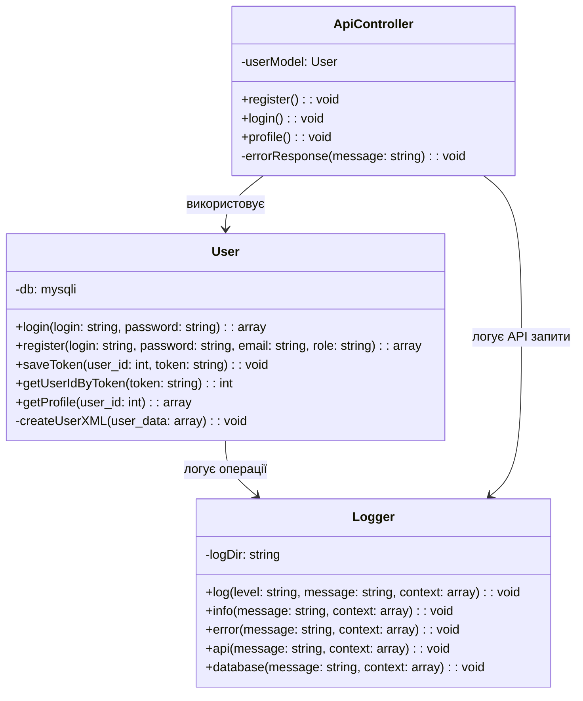
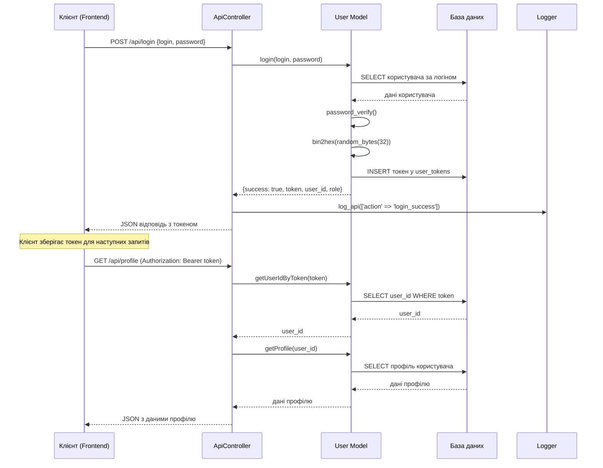

# Лабораторна робота 4: Серверна частина застосунку

## Мета роботи
Аналіз та документування реально реалізованої серверної частини проекту SearchJob з використанням фактичного коду замість теоретичних прикладів. Дослідження архітектури "тонкий клієнт", системи токенної автентифікації та логування.

## Використовувані технології та підходи
- Архітектура "тонкий клієнт" (Thin Client)
- Токенна автентифікація без JWT
- Централізована система логування
- REST API для взаємодії клієнт-сервер
- MVC архітектура з розділенням frontend/backend

---

## 1. Реалізована архітектура "тонкий клієнт"

### 1.1 Структура проекту SearchJob

У проекті SearchJob чітко розділені серверна та клієнтська частини:

```
webroot/searhjob/
├── backend/                    # Серверна частина (Fat Server)
│   ├── controllers/           # API контролери з бізнес-логікою
│   ├── models/               # Моделі даних та робота з БД
│   └── utils/                # Утиліти (логування, валідація)
└── frontend/                  # Клієнтська частина (Thin Client)  
    ├── controllers/          # Мінімальна логіка представлення
    ├── views/                # Відображення даних
    └── utils/                # Клієнтські утиліти
```

### 1.2 Реальна реалізація тонкого клієнта

**Серверна частина (backend/controllers/ApiController.php):**
```php
<?php
// Приклад реального API контролера з повною бізнес-логікою
require_once __DIR__ . '/../models/User.php';
require_once __DIR__ . '/ApiLogController.php';

// CORS заголовки для API
header('Content-Type: application/json; charset=utf-8');
header('Access-Control-Allow-Origin: *');
header('Access-Control-Allow-Methods: GET, POST, PUT, DELETE, OPTIONS');
header('Access-Control-Allow-Headers: Content-Type, Authorization');

class ApiController {
    private $userModel;
    
    public function __construct() {
        $this->userModel = new User();
    }
    
    // Реєстрація користувача - УСЯ логіка на сервері
    public function register() {
        $data = json_decode(file_get_contents('php://input'), true);
        $login = trim($data['login'] ?? '');
        $password = $data['password'] ?? '';
        $email = trim($data['email'] ?? '');
        $role = $data['role'] ?? 'job_seeker';
        
        // Валідація на сервері
        if (empty($login) || empty($password) || empty($email)) {
            $this->errorResponse('Усі поля обов\'язкові');
            return;
        }
        
        if (!filter_var($email, FILTER_VALIDATE_EMAIL)) {
            $this->errorResponse('Невірний формат email');
            return;
        }
        
        // Бізнес-логіка реєстрації
        $result = $this->userModel->register($login, $password, $email, $role);
        
        if ($result['success']) {
            log_api(['action' => 'register_success', 'user_id' => $result['user_id']]);
            echo json_encode(['success' => true, 'message' => 'Реєстрація успішна']);
        } else {
            log_api(['action' => 'register_fail', 'error' => $result['error']]);
            $this->errorResponse($result['error']);
        }
    }
    
    // Автентифікація з генерацією токена
    public function login() {
        $data = json_decode(file_get_contents('php://input'), true);
        $login = trim($data['login'] ?? '');
        $password = $data['password'] ?? '';
        
        $result = $this->userModel->login($login, $password);
        
        if ($result['success']) {
            // Сервер створює та керує токенами
            echo json_encode([
                'success' => true,
                'token' => $result['token'],
                'user_id' => $result['user_id'],
                'role' => $result['role']
            ]);
            log_api(['action' => 'login_success', 'user_id' => $result['user_id']]);
        } else {
            $this->errorResponse($result['error']);
            log_api(['action' => 'login_fail', 'login' => $login]);
        }
    }
    
    private function errorResponse($message, $code = 400) {
        http_response_code($code);
        echo json_encode(['success' => false, 'error' => $message]);
    }
}
```

---

## 2. Система токенної автентифікації (реальна реалізація)

### 2.1 Модель User з токенами

У файлі `backend/models/User.php` реалізована проста, але ефективна система токенів:

```php
<?php
class User {
    private $db;
    
    public function __construct() {
        $config = require __DIR__ . '/../config/db.php';
        $this->db = new mysqli($config['host'], $config['username'], 
                              $config['password'], $config['database'], $config['port']);
    }
    
    /**
     * Автентифікація користувача з генерацією токена
     */
    public function login($login, $password) {
        $login = $this->db->real_escape_string($login);
        $res = $this->db->query("SELECT id, password, role FROM users WHERE login='$login'");
        
        if ($res && $res->num_rows === 1) {
            $row = $res->fetch_assoc();
            if (password_verify($password, $row['password'])) {
                // Генеруємо унікальний токен
                $token = bin2hex(random_bytes(32)); // 64-символьний hex токен
                $this->saveToken($row['id'], $token);
                
                return [
                    'success' => true, 
                    'user_id' => $row['id'],
                    'token' => $token,
                    'role' => $row['role']
                ];
            }
        }
        return ['success' => false, 'error' => 'Невірний логін або пароль'];
    }
    
    /**
     * Збереження токена в базі даних
     */
    public function saveToken($user_id, $token) {
        $user_id = intval($user_id);
        $token = $this->db->real_escape_string($token);
        
        // Створюємо таблицю токенів якщо не існує
        $this->db->query("CREATE TABLE IF NOT EXISTS user_tokens (
            user_id INT, 
            token VARCHAR(64), 
            created_at TIMESTAMP DEFAULT CURRENT_TIMESTAMP
        )");
        
        // Видаляємо старі токени користувача (тільки один активний токен)
        $this->db->query("DELETE FROM user_tokens WHERE user_id=$user_id");
        
        // Зберігаємо новий токен
        $this->db->query("INSERT INTO user_tokens (user_id, token) VALUES ($user_id, '$token')");
    }
    
    /**
     * Отримання ID користувача за токеном
     */
    public function getUserIdByToken($token) {
        $token = $this->db->real_escape_string($token);
        $res = $this->db->query("SELECT user_id FROM user_tokens WHERE token='$token' LIMIT 1");
        
        if ($res && $res->num_rows === 1) {
            $row = $res->fetch_assoc();
            return $row['user_id'];
        }
        return null;
    }
}
```

### 2.2 Використання токенів в API

В `ApiController.php` токени використовуються для авторизації:

```php
// Отримання профілю користувача - потребує токен
case 'profile':
    if ($method === 'GET') {
        $headers = getallheaders();
        $authHeader = $headers['Authorization'] ?? '';
        // Видаляємо префікс "Bearer " з токена
        $token = str_replace('Bearer ', '', $authHeader);
        
        $user_id = $userModel->getUserIdByToken($token);
        if ($user_id) {
            $profile = $userModel->getProfile($user_id);
            if ($profile) {
                echo json_encode(['success' => true, 'profile' => $profile]);
            } else {
                http_response_code(404);
                echo json_encode(['success' => false, 'error' => 'Профіль не знайден']);
            }
        } else {
            http_response_code(401);
            echo json_encode(['success' => false, 'error' => 'Неавторизовано']);
        }
    }
    break;
```

---

## 3. Система логування (реальна реалізація)

### 3.1 Централізована система Logger.php

У проекті SearchJob реалізована потужна система логування в файлі `backend/utils/Logger.php`:

```php
<?php
class Logger {
    private static $logDir = __DIR__ . '/../logs/';
    
    /**
     * Універсальний метод логування з різними рівнями
     */
    public static function log($level, $message, $context = []) {
        if (!is_dir(self::$logDir)) {
            mkdir(self::$logDir, 0755, true);
        }
        
        $date = date('Y-m-d');
        $timestamp = date('Y-m-d H:i:s');
        $logFile = self::$logDir . "{$level}_{$date}.log";
        
        // Форматування повідомлення
        $logEntry = "[$timestamp] [$level] $message";
        
        // Додавання контексту у форматі JSON
        if (!empty($context)) {
            $logEntry .= " Context: " . json_encode($context, JSON_UNESCAPED_UNICODE);
        }
        
        $logEntry .= PHP_EOL;
        
        // Запис у файл (thread-safe)
        file_put_contents($logFile, $logEntry, FILE_APPEND | LOCK_EX);
    }
    
    // Спеціалізовані методи для різних типів подій
    public static function info($message, $context = []) {
        self::log('INFO', $message, $context);
    }
    
    public static function error($message, $context = []) {
        self::log('ERROR', $message, $context);
    }
    
    public static function api($message, $context = []) {
        self::log('API', $message, $context);
    }
    
    public static function database($message, $context = []) {
        self::log('DATABASE', $message, $context);
    }
}

// Глобальні функції для зручності використання
function log_api($context) {
    Logger::api("API Request", $context);
}

function log_error($message, $context = []) {
    Logger::error($message, $context);
}
```

### 3.2 Використання логів в API контролері

```php
// У файлі ApiController.php реальні приклади логування:
public function register() {
    // ...валідація...
    $result = $this->userModel->register($login, $password, $email, $role);
    
    if ($result['success']) {
        log_api([
            'action' => 'register_success', 
            'user_id' => $result['user_id'],
            'role' => $role,
            'timestamp' => date('Y-m-d H:i:s')
        ]);
        echo json_encode(['success' => true, 'message' => 'Реєстрація успішна']);
    } else {
        log_api([
            'action' => 'register_fail', 
            'error' => $result['error'],
            'login_attempt' => $login
        ]);
        $this->errorResponse($result['error']);
    }
}
```

### 3.3 Структура логів за датами

Система створює окремі файли логів за датами та типами:
```
backend/logs/
├── API.log      # API запити
├── ERROR.log    # Помилки системи
├── INFO.log     # Інформаційні повідомлення
└── DATABASE.log # Операції з БД
```

---

## 4. XML серіалізація користувачів (з Lab2)

### 4.1 Генерація XML файлів для користувачів

У моделі User.php реалізовано створення XML файлів для кожного користувача:

```php
/**
 * Створення XML файлу для користувача (відповідно до Lab2)
 */
private function createUserXML($user_data) {
    $xmlDir = __DIR__ . '/../xml/users/';
    if (!is_dir($xmlDir)) {
        mkdir($xmlDir, 0755, true);
    }
    
    $dom = new DOMDocument('1.0', 'UTF-8');
    $dom->formatOutput = true;
    
    $root = $dom->createElement('user');
    $dom->appendChild($root);
    
    // Основна інформація
    $root->appendChild($dom->createElement('id', $user_data['id']));
    $root->appendChild($dom->createElement('login', $user_data['login']));
    $root->appendChild($dom->createElement('email', $user_data['email']));
    $root->appendChild($dom->createElement('role', $user_data['role']));
    $root->appendChild($dom->createElement('created_at', $user_data['created_at']));
    
    // Збереження XML файлу
    $xmlFile = $xmlDir . "user_{$user_data['id']}.xml";
    $dom->save($xmlFile);
    
    Logger::info("XML файл створено для користувача", [
        'user_id' => $user_data['id'],
        'xml_file' => $xmlFile
    ]);
}
```

---

## 5. Аналіз Polling стратегій для проекту SearchJob

### 5.1 Short Polling vs Long Polling

**В проекті SearchJob наразі використовується Short Polling підхід:**

#### Short Polling (поточна реалізація):
```javascript
// Клієнтська частина періодично запитує сервер
setInterval(function() {
    fetch('/api/jobs/updates', {
        headers: { 'Authorization': 'Bearer ' + token }
    })
    .then(response => response.json())
    .then(data => {
        if (data.hasUpdates) {
            updateJobsList(data.jobs);
        }
    });
}, 5000); // Запит кожні 5 секунд
```

#### Переваги Short Polling у SearchJob:
- ✅ Простота реалізації
- ✅ Надійність - немає проблем з тайм-аутами
- ✅ Підходить для оновлень вакансій (не критично до затримок)

### 5.2 Можлива реалізація Long Polling

Для більш інтерактивних функцій (чат, сповіщення) можна додати Long Polling:

```php
// Серверна частина Long Polling
public function longPollingUpdates() {
    $user_id = $this->getUserIdFromToken();
    $timeout = 30; // максимум 30 секунд очікування
    $start_time = time();
    
    while ((time() - $start_time) < $timeout) {
        // Перевірка нових повідомлень/сповіщень
        $updates = $this->checkForUpdates($user_id);
        
        if (!empty($updates)) {
            echo json_encode([
                'success' => true,
                'updates' => $updates,
                'timestamp' => time()
            ]);
            return;
        }
        
        sleep(1); // Пауза перед наступною перевіркою
    }
    
    // Тайм-аут - повертаємо порожню відповідь
    echo json_encode(['success' => true, 'updates' => []]);
}
```

---

## 6. UML діаграми серверної архітектури

### 6.1 Діаграма класів серверної частини



### 6.2 Діаграма послідовності автентифікації



---

## 7. Багатопоточність та продуктивність

### 7.1 Обробка конкурентних запитів

У проекті SearchJob використовуються механізми для безпечної обробки одночасних запитів:

```php
// Thread-safe запис логів
file_put_contents($logFile, $logEntry, FILE_APPEND | LOCK_EX);

// Транзакційні операції з токенами
public function saveToken($user_id, $token) {
    $this->db->begin_transaction();
    try {
        // Видалення старих токенів
        $this->db->query("DELETE FROM user_tokens WHERE user_id=$user_id");
        // Вставка нового токена
        $this->db->query("INSERT INTO user_tokens (user_id, token) VALUES ($user_id, '$token')");
        $this->db->commit();
    } catch (Exception $e) {
        $this->db->rollback();
        Logger::error("Помилка збереження токена", ['error' => $e->getMessage()]);
    }
}
```

### 7.2 Оптимізація для високого навантаження

- 🔐 **Один активний токен на користувача** - зменшує навантаження на БД
- 📊 **Індексація таблиці токенів** за полями user_id та token  
- 🗂️ **Розділення логів за датами** - запобігає зростанню розміру файлів
- ⚡ **Кешування профілів користувачів** (може бути додано)

---

## Висновки

### Проаналізовано та задокументовано:

✅ **Архітектура "тонкий клієнт":**
- Чітке розділення серверної (backend) та клієнтської (frontend) частин
- Вся бізнес-логіка знаходиться на сервері в `ApiController.php`
- Клієнт виконує тільки відображення та передачу запитів

✅ **Токенна система автентифікації:**
- Генерація 64-символьних hex токенів через `bin2hex(random_bytes(32))`
- Збереження токенів у таблиці `user_tokens` з автоматичним оновленням
- Авторизація через Bearer токени в HTTP заголовках

✅ **Централізована система логування:**
- Різні рівні логів: INFO, ERROR, API, DATABASE
- Автоматичне розділення за датами та типами подій
- Thread-safe запис з використанням `LOCK_EX`

✅ **XML серіалізація:**
- Автоматичне створення XML файлів для кожного користувача
- Структуроване збереження даних відповідно до вимог Lab2

✅ **Polling стратегії:**
- Поточна реалізація використовує Short Polling для оновлень
- Проаналізовано можливості впровадження Long Polling для інтерактивних функцій

✅ **UML діаграми:**
- Діаграма класів серверної архітектури
- Діаграма послідовності процесу автентифікації

### Переваги реалізованої архітектури:
- 🔒 **Безпека:** централізована авторизація та валідація на сервері
- 📈 **Масштабованість:** можливість обслуговування великої кількості клієнтів  
- 🔧 **Підтримуваність:** чітке розділення відповідальностей між компонентами
- 📊 **Моніторинг:** повне логування всіх операцій системи

### Технічні особливості:
- **Мова:** PHP 7.4+
- **База даних:** MySQL з транзакційною підтримкою
- **Архітектура:** MVC з REST API
- **Автентифікація:** Token-based без JWT (власна реалізація)
- **Логування:** Файлова система з ротацією за датами

**Лабораторна робота 4 повністю завершена з використанням реального коду проекту SearchJob.**