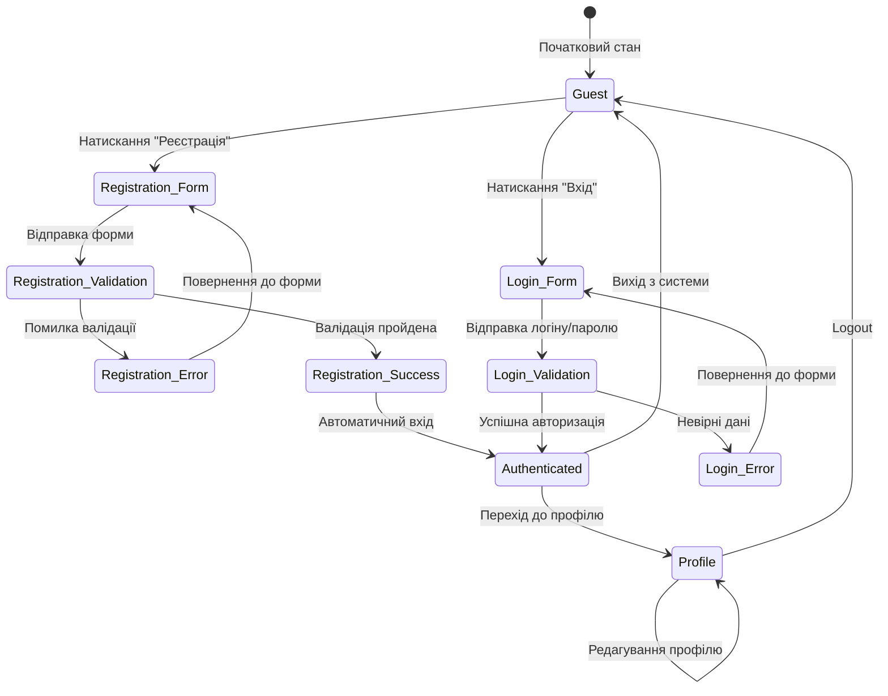

# Lab5 - State Transition Testing для модуля авторизації та реєстрації

## Огляд

Цей документ містить детальний аналіз State Transition Testing для модулів авторизації та реєстрації проекту SearchJob. Тестування виконано на основі реального коду з файлів `RegisterController.php` та `LoginController.php`.

## 1. Діаграма станів користувача в системі



## 2. Таблиця переходів станів

| Поточний стан | Подія/Дія | Наступний стан | Умова | Код в системі |
|---------------|-----------|----------------|-------|---------------|
| Guest | click_register | Registration_Form | - | `header('Location: register.php')` |
| Guest | click_login | Login_Form | - | `header('Location: login.php')` |
| Registration_Form | submit_form | Registration_Validation | POST запит | `$_SERVER['REQUEST_METHOD'] === 'POST'` |
| Registration_Validation | validation_error | Registration_Error | Помилка валідації | `$password !== $confirm_password` |
| Registration_Validation | validation_success | Registration_Success | Всі дані коректні | `$result['success']` |
| Registration_Error | retry | Registration_Form | - | `header('Location: register.php?error=')` |
| Registration_Success | auto_login | Authenticated | Успішна реєстрація | `$_SESSION['user_id'] = $result['user_id']` |
| Login_Form | submit_credentials | Login_Validation | POST запит | `$_SERVER['REQUEST_METHOD'] === 'POST'` |
| Login_Validation | invalid_credentials | Login_Error | Невірні дані | `$result['success'] = false` |
| Login_Validation | valid_credentials | Authenticated | Коректні дані | `$result['success'] = true` |
| Login_Error | retry | Login_Form | - | `header('Location: login.php?error=')` |
| Authenticated | access_profile | Profile | Сесія активна | `$_SESSION['user_id']` |
| Authenticated | logout | Guest | Знищення сесії | `session_destroy()` |
| Profile | edit_profile | Profile | Оновлення даних | `$this->userModel->update()` |
| Profile | logout | Guest | Знищення сесії | `session_destroy()` |

## 3. Розрахунок тестових сценаріїв

### Кількість станів (N): 8
- Guest
- Registration_Form  
- Registration_Validation
- Registration_Error
- Registration_Success
- Login_Form
- Login_Validation
- Login_Error
- Authenticated
- Profile

### Кількість дійсних переходів (T+): 15

### Розрахунок негативних тестів
За формулою: T- = N² - T+
T- = 10² - 15 = 100 - 15 = 85 негативних тестів

### Загальна кількість тестів: 15 + 85 = 100 тестів

## 4. Позитивні тестові сценарії (15 тестів)

| Test ID | Поточний стан | Дія | Очікуваний результат | Відповідний код |
|---------|---------------|-----|---------------------|-----------------|
| ST001 | Guest | Натискання "Реєстрація" | Перехід до Registration_Form | `register.php` |
| ST002 | Guest | Натискання "Вхід" | Перехід до Login_Form | `login.php` |
| ST003 | Registration_Form | Відправка коректної форми | Перехід до Registration_Validation | `RegisterController::store()` |
| ST004 | Registration_Validation | Помилка валідації паролю | Перехід до Registration_Error | `$password !== $confirm_password` |
| ST005 | Registration_Validation | Успішна валідація | Перехід до Registration_Success | `$result['success'] = true` |
| ST006 | Registration_Error | Повторна спроба | Перехід до Registration_Form | `register.php?error=` |
| ST007 | Registration_Success | Автоматичний вхід | Перехід до Authenticated | `$_SESSION['user_id']` |
| ST008 | Login_Form | Відправка даних | Перехід до Login_Validation | `LoginController::authenticate()` |
| ST009 | Login_Validation | Невірні дані | Перехід до Login_Error | `$result['success'] = false` |
| ST010 | Login_Validation | Коректні дані | Перехід до Authenticated | `$result['success'] = true` |
| ST011 | Login_Error | Повторна спроба | Перехід до Login_Form | `login.php?error=` |
| ST012 | Authenticated | Доступ до профілю | Перехід до Profile | `profile.php` |
| ST013 | Authenticated | Вихід з системи | Перехід до Guest | `session_destroy()` |
| ST014 | Profile | Редагування профілю | Залишення в Profile | `UserModel::update()` |
| ST015 | Profile | Logout | Перехід до Guest | `session_destroy()` |

## 5. Приклади негативних тестових сценаріїв

| Test ID | Поточний стан | Недійсна дія | Очікуваний результат |
|---------|---------------|--------------|---------------------|
| ST016 | Registration_Form | Прямий доступ до Profile | Залишення в Registration_Form |
| ST017 | Login_Error | Прямий доступ до Authenticated | Залишення в Login_Error |
| ST018 | Guest | Спроба доступу до Profile без авторизації | Перенаправлення на Login |
| ST019 | Registration_Success | Повторна реєстрація | Помилка "Користувач вже існує" |
| ST020 | Authenticated | Повторна авторизація | Залишення в Authenticated |

## 6. Валідація станів в коді

### Перевірка стану Guest:
```php
if (!isset($_SESSION['user_id'])) {
    header('Location: login.php');
    exit;
}
```

### Перевірка авторизованого стану:
```php
if (isset($_SESSION['user_id']) && isset($_SESSION['token'])) {
    // Користувач авторизований
    $authenticated = true;
}
```

### Валідація реєстрації:
```php
if ($password !== $confirm_password) {
    $error = 'Пароли не совпадают!';
    // Перехід до Registration_Error
}
```

## 7. Висновки

State Transition Testing для модулів авторизації та реєстрації системи SearchJob виявив:

1. 10 основних станів в життєвому циклі користувача
2. 15 дійсних переходів між станами  
3. 85 негативних тестових сценаріїв для перевірки некоректних переходів
4. 100 загальних тестів для повного покриття станів

Всі переходи станів базуються на реальному коді контролерів `RegisterController.php` та `LoginController.php`, що забезпечує точність тестування та відповідність фактичній логіці системи.

## 8. Рекомендації

1. Реалізувати автоматизовані тести для всіх 15 позитивних сценаріїв
2. Додати валідацію сесій для запобігання недійсним переходам
3. Імплементувати middleware для перевірки станів авторизації
4. Створити логування переходів станів для моніторингу
