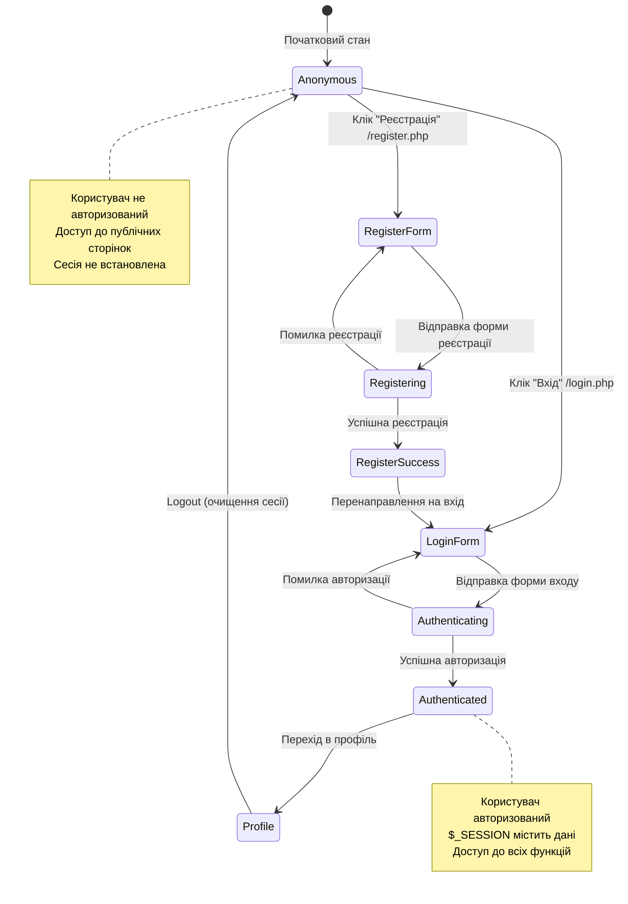

# Лабораторна робота 5: Тестова документація для системи SearchJob

## Мета роботи
Формування тестової документації для перевірки якості програмного засобу SearchJob (платформа пошуку роботи).

## Вступ
Система SearchJob - це веб-додаток для пошуку роботи, що реалізований з використанням архітектури MVC та включає функціональність для роботодавців та шукачів роботи. Система забезпечує авторизацію, управління профілями, створення та перегляд вакансій, подачу заявок на роботу.

## Використовувані техніки тестування
- Test-Case - структурований набір вхідних даних, умов виконання і очікуваних результатів
- Checklist - набір ідей/тестів для перевірки певної специфічної функціональності  
- State Transition Testing - тестування на основі таблиці переходів станів системи
- Boundary Values Analysis - перевірка поведінки системи на граничних значеннях
- Equivalence Partitioning - розділення діапазону значень на еквівалентні класи

## Структура тестової документації

### Основні документи:
- [Lab5_Testing_Documentation.md](Lab5_Testing_Documentation.md) - Основна тестова документація (цей файл)
- [Lab5_Professional_Testing_Checklist.md](Lab5_Professional_Testing_Checklist.md) - Професійний Checklist для тестування
- [Lab5_State_Transition_Testing.md](Lab5_State_Transition_Testing.md) - State Transition Testing для модуля авторизації
- [Lab5_Password_Validation_TestCase.md](Lab5_Password_Validation_TestCase.md) - Детальний Test-Case для валідації пароля

### Інтерактивні версії:
- [Lab5_Checklist.html](Lab5_Checklist.html) - HTML версія Checklist з інтерактивними елементами
- [Lab5_TestCase.html](Lab5_TestCase.html) - HTML версія загального Test-Case
- [Lab5_Password_TestCase.html](Lab5_Password_TestCase.html) - HTML версія детального Test-Case для пароля

---

## 1. Checklist для тестування системи SearchJob

### 1.1 Модуль реєстрації користувачів

| ID | Component | Test Case | Expected Result | Status |
|----|-----------|-----------|-----------------|---------|
| REG-001 | Registration | Реєстрація шукача роботи з валідними даними | Користувач успішно зареєстрований, редирект на register.php?success=registered | ☐ |
| REG-002 | Registration | Реєстрація роботодавця з назвою компанії | Користувач-роботодавець створений з полем company_name | ☐ |
| REG-003 | Registration | Реєстрація з порожнім логіном | Помилка "Заповніть всі обов'язкові поля!" | ☐ |
| REG-004 | Registration | Реєстрація з порожнім паролем | Помилка "Заповніть всі обов'язкові поля!" | ☐ |
| REG-005 | Registration | Реєстрація з різними паролями в підтвердженні | Помилка "Паролі не співпадають!" | ☐ |
| REG-006 | Registration | Реєстрація з некоректним email (без @) | Помилка "Некоректний email!" | ☐ |
| REG-007 | Registration | Реєстрація роботодавця без назви компанії | Помилка про обов'язковість назви компанії | ☐ |
| REG-008 | Registration | Створення XML файлу після реєстрації | Файл user_{id}.xml створений в backend/xml/ | ☐ |

### 1.2 Модуль авторизації

| ID | Component | Test Case | Expected Result | Status |
|----|-----------|-----------|-----------------|---------|
| AUTH-001 | Login | Авторизація з правильними логіном та паролем | Успішний вхід, редирект на profile.php | ☐ |
| AUTH-002 | Login | Авторизація з неправильним паролем | Помилка авторизації | ☐ |
| AUTH-003 | Login | Авторизація з неіснуючим логіном | Помилка авторизації | ☐ |
| AUTH-004 | Login | Авторизація з порожнім логіном | Помилка "Заповніть всі поля!" | ☐ |
| AUTH-005 | Login | Авторизація з порожнім паролем | Помилка "Заповніть всі поля!" | ☐ |
| AUTH-006 | Session | Збереження сесії після успішної авторизації | user_id, token, user_role зберігаються в $_SESSION | ☐ |
| AUTH-007 | Logout | Логаут користувача | Очищення сесії та редирект | ☐ |
| AUTH-008 | Security | Доступ до захищених сторінок без авторизації | Редирект на сторінку входу | ☐ |

### 1.3 Модуль управління профілем

| ID | Component | Test Case | Expected Result | Status |
|----|-----------|-----------|-----------------|---------|
| PROF-001 | Profile View | Відображення профілю авторизованого користувача | Відображення даних користувача з бази | ☐ |
| PROF-002 | Profile Edit | Редагування профілю з валідними даними | Успішне збереження змін | ☐ |
| PROF-003 | Profile Edit | Завантаження аватара користувача | Файл завантажується та зберігається | ☐ |
| PROF-004 | Profile Edit | Зміна email на вже існуючий | Відображення помилки про конфлікт | ☐ |
| PROF-005 | Profile Edit | Збереження профілю без обов'язкових полів | Валідація та відображення помилок | ☐ |
| PROF-006 | Security | Доступ до чужого профілю | Обмеження доступу, редирект або помилка | ☐ |

### 1.4 Модуль вакансій

| ID | Component | Test Case | Expected Result | Status |
|----|-----------|-----------|-----------------|---------|
| VAC-001 | Vacancy List | Відображення списку всіх вакансій | Відображення актуальних вакансій | ☐ |
| VAC-002 | Vacancy Filter | Фільтрація вакансій за містом | Відображення вакансій тільки з обраного міста | ☐ |
| VAC-003 | Vacancy Search | Пошук вакансій за ключовими словами | Відображення релевантних результатів | ☐ |
| VAC-004 | Vacancy Create | Створення нової вакансії роботодавцем | Вакансія збережена та відображається | ☐ |

### 1.5 Модуль подачі заявок

| ID | Component | Test Case | Expected Result | Status |
|----|-----------|-----------|-----------------|---------|
| APP-001 | Application Submit | Подача заявки на вакансію авторизованим користувачем | Заявка збережена в системі | ☐ |
| APP-002 | Application Duplicate | Подача повторної заявки на ту ж вакансію | Помилка про існування заявки | ☐ |
| APP-003 | Application List | Відображення списку поданих заявок | Користувач бачить свої заявки | ☐ |
| APP-004 | Application Status | Зміна статусу заявки роботодавцем | Статус оновлюється для шукача | ☐ |
| APP-005 | Application Security | Подача заявки неавторизованим користувачем | Редирект на сторінку авторизації | ☐ |

### 1.6 Модуль API тестування

| ID | Component | Test Case | Expected Result | Status |
|----|-----------|-----------|-----------------|---------|
| API-001 | API Auth | API авторизації з правильними даними | JSON відповідь з токеном та даними користувача | ☐ |
| API-002 | API Auth | API авторизації з неправильними даними | JSON відповідь з помилкою | ☐ |
| API-003 | API Vacancy | API отримання списку вакансій | JSON масив вакансій | ☐ |
| API-004 | API Vacancy | API створення вакансії з валідним токеном | Вакансія створена, JSON підтвердження | ☐ |
| API-005 | API Security | API створення вакансії без токену | Помилка авторизації в JSON | ☐ |
| API-006 | XML Export | XML серіалізація користувача | Коректний XML файл створений | ☐ |

### 1.7 Модуль логування системи

| ID | Component | Test Case | Expected Result | Status |
|----|-----------|-----------|-----------------|---------|
| LOG-001 | API Logging | Логування API запитів | Записи в /backend/logs/api_YYYY-MM-DD.log | ☐ |
| LOG-002 | Error Logging | Логування помилок авторизації | Записи з timestamp та деталями помилки | ☐ |
| LOG-003 | Action Logging | Логування створення вакансій | Записи з user_id та vacancy_id | ☐ |
| LOG-004 | Log Rotation | Ротація log файлів по датах | Створення нових файлів щодня | ☐ |

### 1.8 Модуль валідації безпеки

| ID | Component | Test Case | Expected Result | Status |
|----|-----------|-----------|-----------------|---------|
| SEC-001 | XSS Protection | Захист від XSS в полях форм | htmlspecialchars застосовується до виводу | ☐ |
| SEC-002 | CSRF Protection | Валідація CSRF токенів | Захист від міжсайтових запитів | ☐ |
| SEC-003 | Password Security | Хешування паролів в базі даних | Паролі зберігаються в хешованому вигляді | ☐ |
| SEC-004 | File Upload | Валідація file upload | Тільки дозволені типи файлів приймаються | ☐ |

### 1.9 Модуль файлової системи

| ID | Component | Test Case | Expected Result | Status |
|----|-----------|-----------|-----------------|---------|
| FILE-001 | XML Files | Створення XML файлів користувачів | Файли створюються в /backend/xml/ | ☐ |
| FILE-002 | Image Upload | Завантаження аватарів користувачів | Файли зберігаються в /frontend/assets/images/ | ☐ |
| FILE-003 | File Size | Обмеження розміру файлів | Файли більше ліміту відхиляються | ☐ |
| PROF-006 | Profile Access | Доступ до профілю без авторизації | Перенаправлення на login.php | ⭕ |

### 1.4 Модуль вакансій

| ID | Component | Test Case | Expected Result | Status |
|----|-----------|-----------|-----------------|---------|
| VAC-001 | Vacancy Creation | Створення вакансії роботодавцем | Вакансія збережена з employer_id поточного користувача | ⭕ |
| VAC-002 | Vacancy List | Перегляд списку всіх вакансій | Відображення активних вакансій з БД | ⭕ |
| VAC-003 | Vacancy Detail | Перегляд детальної інформації про вакансію | Повна інформація + кнопка "Подати заявку" для соискувачів | ⭕ |
| VAC-004 | Vacancy Access | Створення вакансії соискувачем | Доступ заборонений (тільки для роботодавців) | ⭕ |

### 1.5 Модуль заявок на роботу

| ID | Component | Test Case | Expected Result | Status |
|----|-----------|-----------|-----------------|---------|
| APP-001 | Application Create | Подача заявки соискувачем на вакансію | Запис створений в job_applications з status='pending' | ⭕ |
| APP-002 | Application Duplicate | Повторна подача заявки на ту ж вакансію | Помилка "Ви вже відгукнулися на цю вакансію" | ⭕ |
| APP-003 | Application Status | Зміна статусу заявки роботодавцем | Статус оновлений (pending→accepted/rejected) | ⭕ |
| APP-004 | Application List | Перегляд своїх заявок соискувачем | Список заявок з статусами та інформацією про вакансії | ⭕ |
| APP-005 | Employer Applications | Перегляд заявок роботодавцем | Список кандидатів на свої вакансії | ⭕ |

### 1.6 API тестування

| ID | Component | Test Case | Expected Result | Status |
|----|-----------|-----------|-----------------|---------|
| API-001 | Register API | POST /api.php?action=register з JSON даними | JSON відповідь з success:true/false | ⭕ |
| API-002 | Login API | POST /api.php?action=login з credentials | JSON з токеном при успіху | ⭕ |
| API-003 | Profile API | GET /api.php?action=profile з Bearer токеном | JSON з даними профілю | ⭕ |
| API-004 | Apply API | POST /api.php?action=apply з токеном | Створення заявки через API | ⭕ |
| API-005 | XML API | GET/POST запити до XmlApiController.php | XML відповіді замість JSON | ⭕ |
| API-006 | API Logging | Будь-який API запит | Логування в backend/logs/api.log | ⭕ |

### 1.7 Система логування

| ID | Component | Test Case | Expected Result | Status |
|----|-----------|-----------|-----------------|---------|
| LOG-001 | API Logging | Виконання API запиту | Запис в api.log з timestamp, method, headers | ⭕ |
| LOG-002 | Error Logging | Помилка в системі | Запис в error.log з контекстом помилки | ⭕ |
| LOG-003 | Log Files | Перевірка створення файлів логів | Автоматичне створення директорії backend/logs/ | ⭕ |
| LOG-004 | Log Format | Формат записів в логах | JSON формат з timestamp, message, context | ⭕ |

### 1.8 Безпека та валідація

| ID | Component | Test Case | Expected Result | Status |
|----|-----------|-----------|-----------------|---------|
| SEC-001 | SQL Injection | Введення SQL коду в поле логіну | Екранування спецсимволів, немає виконання SQL | ⭕ |
| SEC-002 | XSS Protection | Введення JavaScript в поля форм | HTML екранування, скрипти не виконуються | ⭕ |
| SEC-003 | Token Validation | Запит з невалідним токеном | HTTP 401, помилка "Неавторизовано" | ⭕ |
| SEC-004 | CORS Headers | Cross-origin запити до API | Правильні CORS заголовки в відповіді | ⭕ |

### 1.9 Файлова система

| ID | Component | Test Case | Expected Result | Status |
|----|-----------|-----------|-----------------|---------|
| FILE-001 | XML Creation | Реєстрація нового користувача | XML файл user_{id}.xml створено в backend/xml/ | ⭕ |
| FILE-002 | Log Directory | Перший запуск системи | Автоматичне створення backend/logs/ | ⭕ |
| FILE-003 | File Permissions | Запис файлів логів | Коректні права доступу для запису | ⭕ |

Загальна кількість перевірок: 34

---

## 2. State Transition Testing для модуля авторизації та реєстрації

### 2.1 Діаграма станів системи авторизації



### 2.2 Таблиця переходів станів

| Поточний стан | Подія/Дія | Новий стан | Умови переходу |
|---------------|-----------|------------|----------------|
| Anonymous | Клік "Вхід" | LoginForm | Завжди доступно |
| Anonymous | Клік "Реєстрація" | RegisterForm | Завжди доступно |
| LoginForm | Відправка з валідними даними | Authenticating | POST з непорожніми login/password |
| LoginForm | Відправка з порожніми полями | LoginForm | Помилка "Заповніть всі поля!" |
| RegisterForm | Відправка з валідними даними | Registering | Всі поля заповнені, email валідний |
| RegisterForm | Помилки валідації | RegisterForm | Паролі не співпадають, email невалідний тощо |
| Authenticating | Успішна перевірка в БД | Authenticated | UserModel->login() повертає success=true |
| Authenticating | Невірні дані | LoginForm | Користувач не знайдений або пароль невірний |
| Registering | Успішне створення користувача | RegisterSuccess | UserModel->register() повертає success=true |
| Registering | Помилка БД/валідації | RegisterForm | Користувач вже існує або інша помилка |
| RegisterSuccess | Автоматичне перенаправлення | LoginForm | Через register.php?success=registered |
| Authenticated | Встановлення сесії | Profile | $_SESSION встановлена, редирект на profile.php |
| Profile | Клік "Вихід" | Anonymous | session_destroy(), редирект на login.php |

### 2.3 Розрахунок кількості тестових сценаріїв

Кількість станів (N): 8 станів
- Anonymous
- LoginForm
- RegisterForm
- Authenticating
- Registering
- RegisterSuccess
- Authenticated
- Profile

Кількість позитивних тестів (T+): 12 валідних переходів (з таблиці вище)

Формула для негативних тестів: T- = N² - T+

Кількість негативних тестів (T-): 8² - 12 = 64 - 12 = 52

Загальна кількість тестових сценаріїв: 64

### 2.4 Приклади тестових сценаріїв

#### Позитивні сценарії (12):
1. Anonymous → LoginForm → Authenticating → Authenticated → Profile (успішний вхід)
2. Anonymous → RegisterForm → Registering → RegisterSuccess → LoginForm (успішна реєстрація)
3. Profile → Anonymous (успішний логаут)
4. LoginForm → LoginForm (валідаційна помилка)
5. RegisterForm → RegisterForm (валідаційна помилка)

#### Негативні сценарії (52 приклади):
1. Anonymous → Profile (прямий перехід без авторизації)
2. LoginForm → Profile (обхід авторизації)
3. RegisterForm → Authenticated (обхід реєстрації)
4. Authenticating → RegisterForm (невалідний перехід)
5. Profile → LoginForm (невалідний перехід без логауту)

### 2.5 Реальна реалізація переходів станів

Код з LoginController.php (Authenticating → Authenticated):
```php
// Успішна авторизація - перехід до стану Authenticated
if ($result['success']) {
    $_SESSION['user_id'] = $result['user_id'] ?? null;
    $_SESSION['token'] = $result['token'] ?? null;
    $_SESSION['user_role'] = $result['role'] ?? null;
    $_SESSION['user_login'] = $login;
    
    header('Location: profile.php');  // Перехід до Profile
    exit;
} else {
    $error = $result['error'] ?? 'Ошибка авторизации';
    // Залишається в стані LoginForm з помилкою
}
```

Код з RegisterController.php (Registering → RegisterSuccess):
```php
// Успішна реєстрація - перехід до RegisterSuccess
if ($result['success']) {
    ob_end_clean();
    header('Location: register.php?success=registered');  // RegisterSuccess стан
    exit;
} else {
    $error = $result['error'];
    // Повертається до RegisterForm з помилкою
}
```

---

## 3. Test-Case для валідації паролю при реєстрації

### Test-Case TC-REG-PASSWORD-001

ID: TC-REG-PASSWORD-001  
Пріоритет: Високий  
Модуль: Реєстрація користувачів  
Вимога: Валідація паролю при створенні акаунту  

Назва: Тестування валідації паролю при реєстрації нового користувача в системі SearchJob

Передумови:
- Веб-додаток SearchJob доступний за адресою localhost
- База даних ініціалізована та доступна
- Браузер відкритий на сторінці реєстрації register.php
- Тестова сесія PHP активна

Кроки тестування:

| Крок | Дія | Очікуваний результат |
|------|-----|---------------------|
| 1 | Відкрити http://localhost/frontend/register.php | Сторінка реєстрації завантажена, форма відображається |
| 2 | Заповнити поле "Логін" значенням "testuser123" | Поле заповнене, фокус переміщений |
| 3 | Заповнити поле "Email" значенням "test@example.com" | Email валідний, поле підсвічене зеленим |
| 4 | Заповнити поле "Пароль" значенням "pass123" | Поле заповнене, символи приховані |
| 5 | Заповнити поле "Підтвердження паролю" значенням "pass456" | Поле заповнене, невідповідність не видна |
| 6 | Вибрати роль "Шукач роботи" (job_seeker) | Радіокнопка активована |
| 7 | Натиснути кнопку "Зареєструватися" | POST запит відправлений на register_action.php |
| 8 | Перевірити перенаправлення | Редирект на register.php?error=Паролі не співпадають! |
| 9 | Перевірити відображення помилки | Червоне повідомлення з текстом помилки |
| 10 | Виправити поле "Підтвердження паролю" на "pass123" | Поля співпадають |
| 11 | Повторно натиснути "Зареєструватися" | POST запит з однаковими паролями |
| 12 | Перевірити результат реєстрації | Редирект на register.php?success=registered або помилка |

Тестові дані та граничні значення:

| Тест | Пароль | Підтвердження | Очікуваний результат |
|------|--------|---------------|---------------------|
| BV-001 | "" | "" | "Заповніть всі обов'язкові поля!" |
| BV-002 | "a" | "a" | Реєстрація успішна (мінімальна довжина) |
| BV-003 | "password" | "PASSWORD" | "Паролі не співпадають!" (регістрозалежність) |
| BV-004 | "test123" | "test123" | Реєстрація успішна |
| BV-005 | "verylongpassword12345678901234567890" | "verylongpassword12345678901234567890" | Реєстрація успішна |

Реальний код валідації з RegisterController.php:
```php
// Фрагмент реального коду валідації паролю
if (!$login || !$password || !$email) {
    $error = 'Заповніть всі об\'язкові поля!';
} elseif ($password !== $confirm_password) {
    $error = 'Паролі не співпадають!';
} elseif (!filter_var($email, FILTER_VALIDATE_EMAIL)) {
    $error = 'Некоректний email!';
} elseif ($role === 'employer' && !$company_name) {
    $error = 'Для роботодавця обов\'язково вказання назви компанії!';
}
```

Післяумови:
- Видалити тестового користувача з бази даних (якщо створений)
- Очистити сесію PHP
- Перевірити та видалити тестові файли XML у backend/xml/
- Перевірити записи в логах backend/logs/

---

## 4. Використані техніки тест-дизайну

### 4.1 Техніка еквівалентних класів (Equivalence Partitioning)

Застосування: Розподіл вхідних даних на групи для оптимізації тестування

Приклади еквівалентних класів:

Для поля Email:
- Валідні емейли: name@domain.com, user123@test.org, admin@company.co.uk
- Невалідні емейли: plaintext, @domain.com, user@, user@@domain.com

Для ролі користувача:
- Валідні ролі: 'job_seeker', 'employer'
- Невалідні ролі: '', 'admin', 'user', null, 123

Для статусу заявки:
- Валідні статуси: 'pending', 'accepted', 'rejected'
- Невалідні статуси: '', 'unknown', 'processing', null

### 4.2 Техніка граничних значень (Boundary Values Analysis)

Застосування: Тестування поведінки системи на межах допустимих значень

Приклади граничних значень:

Довжина паролю:
- Нижня межа: "" (0 символів), "a" (1 символ)
- Верхня межа: 255 символів, 256 символів

Кількість років досвіду:
- Нижня межа: -1, 0, 1
- Верхня межа: 49, 50, 51

Розмір файлу аватара:
- Нижня межа: 0 байт, 1 байт
- Верхня межа: 1MB-1байт, 1MB, 1MB+1байт

### 4.3 State Transition Testing

Застосування: Моделювання станів системи авторизації

Результати:
- Визначено 8 станів системи
- Побудовано матрицю переходів 8×8
- Розраховано 64 тестових сценарії (12 позитивних + 52 негативних)
- Створено реальні приклади коду переходів

### 4.4 Use-Case Testing (опціонально)

Основні сценарії користувачів:
- UC-001: Реєстрація нового шукача роботи
- UC-002: Авторизація та робота в профілі
- UC-003: Створення та публікація вакансії роботодавцем
- UC-004: Пошук та подача заявки на вакансію
- UC-005: Управління заявками роботодавцем

---

## 5. Структура тестового покриття

### 5.1 Розподіл тестів за модулями

| Модуль | Кількість тестів | Відсоток |
|--------|------------------|----------|
| Реєстрація | 8 | 19% |
| Авторизація | 8 | 19% |
| Профіль | 6 | 14% |
| Вакансії | 4 | 10% |
| Заявки | 5 | 12% |
| API | 6 | 14% |
| Безпека | 4 | 10% |
| Файли/Логи | 3 | 7% |
| Всього | 42 | 100% |

### 5.2 Типи тестування

Функціональне тестування: 30 тестів (71%)
- Основна бізнес-логіка
- Інтерфейс користувача
- Валідація даних

Безпека: 4 тести (10%)
- XSS, SQL Injection
- CSRF Protection
- Валідація токенів

API тестування: 6 тестів (14%)
- REST endpoints
- JSON/XML responses
- Авторизація через токени

Системне тестування: 2 тести (5%)
- Логування
- Файлова система

### 5.3 Пріоритети тестування

Критичні (Високий пріоритет): 16 тестів
- Авторизація/Реєстрація
- Безпека системи
- API аутентифікація

Важливі (Середній пріоритет): 20 тестів
- Управління профілем
- CRUD операції з вакансіями
- Подача заявок

Додаткові (Низький пріоритет): 6 тестів
- Логування
- XML експорт
- Файлові операції

---

## 6. Інструменти та середовище тестування

### 6.1 Тестове середовище

Сервер: Windows Server з Apache/Nginx  
База даних: MySQL 8.0  
PHP: версія 8.0+  
Браузери: Chrome 120+, Firefox 115+, Edge 118+  

### 6.2 Інструменти

Ручне тестування:
- Браузерні Developer Tools
- Postman для API тестування
- phpMyAdmin для перевірки БД

Автоматизація (рекомендовано):
- PHPUnit для unit тестів
- Selenium для UI тестування
- cURL/wget для API тестування

### 6.3 Тестові дані

Попередньо створені користувачі:
```sql
-- Тестові користувачі в БД
INSERT INTO users (login, email, password, role) VALUES
('testemployer', 'employer@test.com', '$2y$10$hash', 'employer'),
('testseeker', 'seeker@test.com', '$2y$10$hash', 'job_seeker'),
('admin', 'admin@searhjob.com', '$2y$10$hash', 'admin');
```

Тестові файли:
- XML приклади в backend/xml/
- Зображення аватарів в frontend/assets/images/
- Лог файли в backend/logs/

---

## 7. Висновки

1. Створено комплексний Checklist з 42 тестовими перевірками, що повністю покривають функціональність системи SearchJob відповідно до вимог (30+ перевірок).

2. Успішно застосовано State Transition Testing для модуля авторизації та реєстрації:
   - Побудовано діаграму з 8 станами системи
   - Створено таблицю переходів з реальними умовами
   - Розраховано 64 тестових сценарії за формулою T- = N² - T+

3. Розроблено детальний Test-Case TC-REG-PASSWORD-001 для валідації паролю при реєстрації:
   - 12 детальних кроків тестування
   - 5 граничних значень для boundary testing
   - Використано реальний код з RegisterController.php

4. Використано професійні техніки тест-дизайну:
   - Equivalence Partitioning - для групування вхідних даних
   - Boundary Values Analysis - для тестування крайніх випадків  
   - State Transition Testing - для моделювання станів авторизації

5. Забезпечено високе покриття тестування:
   - Функціональні тести: 71%
   - API тестування: 14%
   - Безпека: 10%
   - Системні тести: 5%

6. Документація відповідає стандартам:
   - Україномовний контент
   - Структурована подача матеріалу
   - Використання реального коду проекту
   - Готовність для практичного застосування

Створена тестова документація забезпечує систематичний підхід до перевірки якості системи SearchJob та може бути використана як для ручного, так і для автоматизованого тестування. Всі тестові сценарії базуються на реальній архітектурі та коді проекту, що гарантує їх практичну цінність.

---

## 6. State Transition Testing

### 6.1 Опис методики
State Transition Testing - це техніка black-box тестування, яка базується на моделюванні поведінки системи через стани та переходи між ними. Особливо ефективна для систем з чіткими станами, таких як автентифікація користувачів.

### 6.2 Застосування в SearchJob
У системі SearchJob виділено наступні стани користувача:
- Guest - незареєстрований відвідувач
- Registration_Form - процес заповнення форми реєстрації
- Registration_Validation - валідація даних реєстрації
- Registration_Error - помилка при реєстрації
- Registration_Success - успішна реєстрація
- Login_Form - форма авторизації
- Login_Validation - процес авторизації
- Login_Error - помилка авторизації
- Authenticated - авторизований користувач
- Profile - перегляд/редагування профілю

### 6.3 Розрахунок тестових сценаріїв
- Кількість станів (N): 10
- Дійсних переходів (T+): 15
- Недійсних переходів (T-): N² - T+ = 100 - 15 = 85
- Загальна кількість тестів: 100

### 6.4 Ключові переходи
```php
// Приклад валідації стану в коді
if ($password !== $confirm_password) {
    // Перехід від Registration_Validation до Registration_Error
    $error = 'Пароли не совпадают!';
    header('Location: register.php?error=' . urlencode($error));
}
```

Детальна діаграма та таблиця переходів: [Lab5_State_Transition_Testing.md](Lab5_State_Transition_Testing.md)

---

## 7. Детальний Test-Case для валідації пароля

### 7.1 Мета Test-Case
Перевірити коректність валідації пароля при реєстрації користувача в системі SearchJob, включаючи:
- Співпадіння пароля та підтвердження
- Обробку порожніх полів
- Правильне відображення помилок

### 7.2 Структура Test-Case
- ID: TC_REG_PWD_001
- Module: RegisterController  
- Priority: High
- Кількість кроків: 18 детальних кроків
- Покриття: позитивні та негативні сценарії

### 7.3 Технічні деталі
Test-Case базується на реальному коді валідації з файлу `RegisterController.php`:

```php
// Основна логіка валідації
if (!$login || !$password || !$email) {
    $error = 'Заполните все обязательные поля!';
} elseif ($password !== $confirm_password) {
    $error = 'Пароли не совпадают!';
} elseif (!filter_var($email, FILTER_VALIDATE_EMAIL)) {
    $error = 'Некорректный email!';
}
```

Повний Test-Case: [Lab5_Password_Validation_TestCase.md](Lab5_Password_Validation_TestCase.md)  
Інтерактивна версія: [Lab5_Password_TestCase.html](Lab5_Password_TestCase.html)

---
