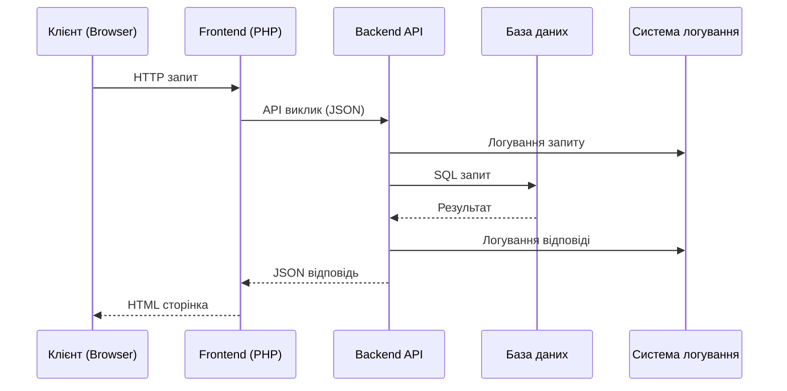
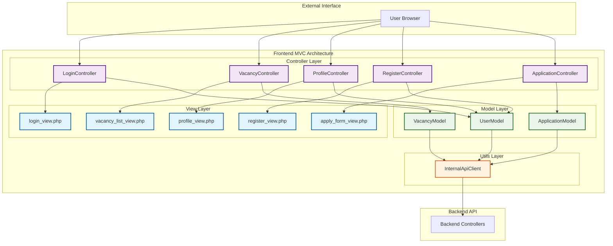
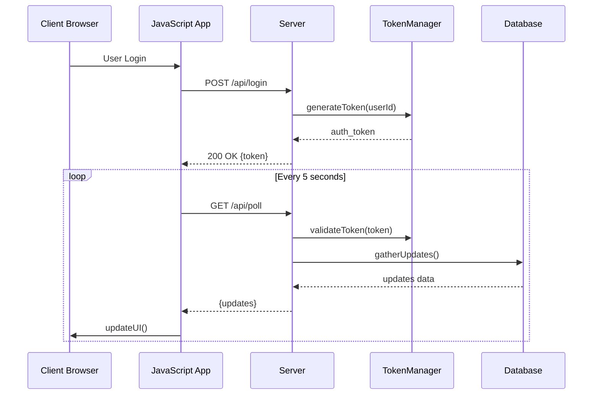
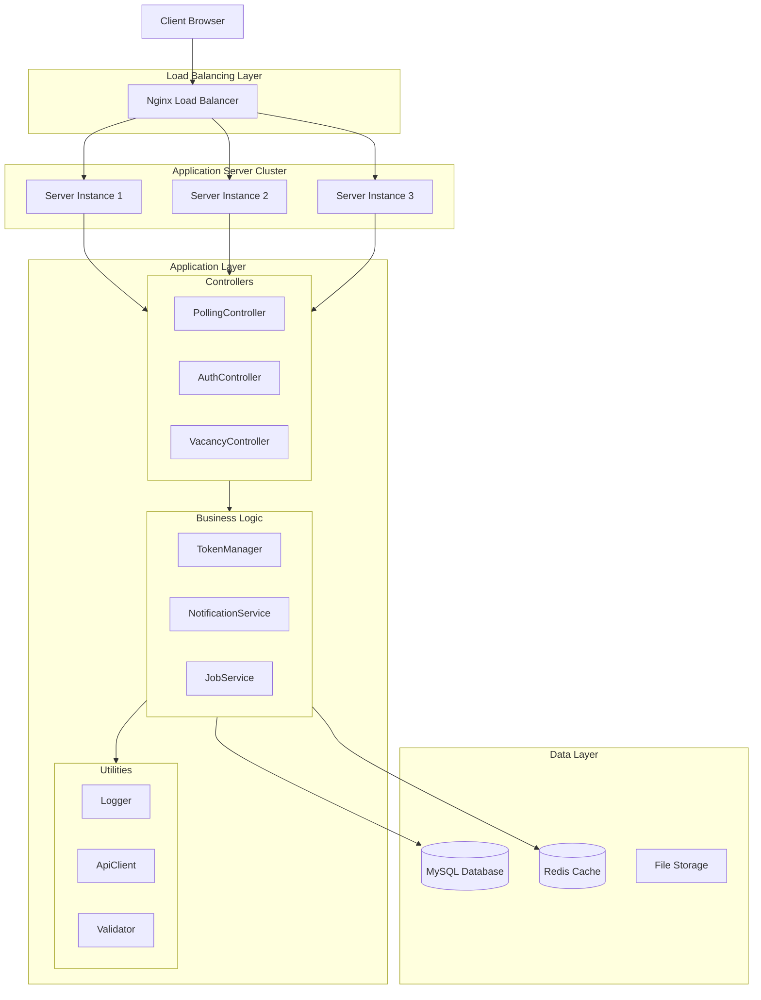

# SearchJob - Технічна документація проекту

## 📋 Опис проекту
SearchJob - це веб-платформа для пошуку роботи, що дозволяє кандидатам шукати вакансії, а роботодавцям - розміщувати оголошення про роботу.

## 🏗️ Архітектура системи
Проект реалізований з використанням:
- Backend: PHP з REST API
- Frontend: PHP MVC архітектура
- База даних: MySQL
- Серіалізація: JSON (основна) + XML (альтернативна)
- Логування: JSON структуровані логи

## 📚 Лабораторні роботи

### 🔧 [Лабораторна робота 1: Технічні вимоги та інфраструктура](Lab1_TechnicalRequirements.md)
- Аналіз вимог до проекту
- Дослідження конкурентів
- Технічні специфікації
- Інфраструктура розгортання

### 🌐 [Лабораторна робота 2: Клієнт-серверна архітектура](Lab2_ClientServer_Architecture.md)
- Трирівнева клієнт-серверна архітектура
- UML діаграма взаємодії клієнт-сервер
- JSON та XML серіалізація/десеріалізація
- Система логування

UML діаграма взаємодії:


### 🎨 [Лабораторна робота 3: Архітектура клієнтської частини](Lab3_ClientSide_Architecture.md)
- MVC (Model-View-Controller) патерн
- UML діаграми компонентів та класів
- Детальна реалізація архітектури

MVC Архітектура:


### 🖥️ [Лабораторна робота 4: Серверний додаток](Lab4_ServerSide_Application.md)
- Архітектура "тонкий клієнт" (Thin Client)
- Токенна автентифікація замість паролів
- Short Polling для real-time оновлень
- Комплексна система логування
- UML діаграми серверної архітектури

Short Polling схема:


Серверна архітектура:


## 🚀 Як переглянути діаграми

### GitHub
Всі Mermaid діаграми автоматично рендеряться при перегляді файлів в GitHub репозиторії.

### GitLab
GitLab також нативно підтримує Mermaid діаграми в Markdown файлах.

### Локально
Для перегляду діаграм локально можна використовувати:
- VS Code з розширенням "Mermaid Preview"
- Typora редактор
- Mermaid Live Editor (mermaid.live)

## 📁 Структура проекту

```
project/
├── Lab1_TechnicalRequirements.md    # Технічні вимоги
├── Lab2_ClientServer_Architecture.md # Клієнт-серверна архітектура  
├── Lab3_ClientSide_Architecture.md   # Клієнтська архітектура
├── Lab4_ServerSide_Application.md    # Серверний додаток
├── webroot/searhjob/                 # Основний код проекту
│   ├── backend/                      # Серверна частина
│   │   ├── controllers/              # API контролери
│   │   ├── models/                   # Моделі даних
│   │   ├── utils/                    # Утиліти та логування
│   │   └── logs/                     # Файли логів
│   └── frontend/                     # Клієнтська частина
│       ├── controllers/              # MVC контролери
│       ├── models/                   # MVC моделі
│       ├── views/                    # MVC представлення
│       └── assets/                   # Статичні ресурси
└── nginx/                            # Конфігурація веб-сервера
```

## 🛠️ Технології

- Backend: PHP 7.4+, MySQL 8.0
- Frontend: PHP MVC, HTML5, CSS3, JavaScript
- Серіалізація: JSON, XML
- Логування: Структуровані JSON логи
- Веб-сервер: Nginx
- Документація: Markdown з Mermaid діаграмами

## 📖 Додаткова інформація

Кожна лабораторна робота містить:
- Детальний технічний опис
- UML діаграми в Mermaid форматі
- Приклади коду та реалізації
- Аналіз архітектурних рішень

Всі діаграми автоматично відображаються в GitHub/GitLab як інтерактивні зображення.
