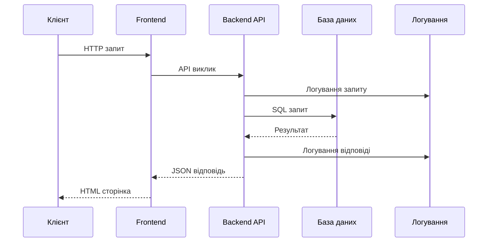
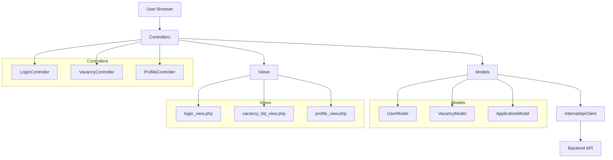

# SearchJob - Технічна документація проекту

## 📋 Опис проекту
SearchJob - це веб-платформа для пошуку роботи, що дозволяє кандидатам шукати вакансії, а роботодавцям - розміщувати оголошення про роботу.

## 🏗️ Архітектура системи
Проект реалізований з використанням:
- **Backend**: PHP з REST API
- **Frontend**: PHP MVC архітектура
- **База даних**: MySQL
- **Серіалізація**: JSON (основна) + XML (альтернативна)
- **Логування**: JSON структуровані логи

## 📚 Лабораторні роботи

### 🔧 [Лабораторна робота 1: Технічні вимоги та інфраструктура](Lab1_TechnicalRequirements.md)
- Аналіз вимог до проекту
- Дослідження конкурентів
- Технічні специфікації
- Інфраструктура розгортання

### 🌐 [Лабораторна робота 2: Клієнт-серверна архітектура](Lab2_ClientServer_Architecture.md)

**UML діаграма взаємодії:**



### 🎨 [Лабораторна робота 3: Архітектура клієнтської частини](Lab3_ClientSide_Architecture.md)

**MVC Архітектура Frontend:**



## 📁 Структура проекту

```
project/
├── Lab1_TechnicalRequirements.md    # Технічні вимоги
├── Lab2_ClientServer_Architecture.md # Клієнт-серверна архітектура  
├── Lab3_ClientSide_Architecture.md   # Клієнтська архітектура
├── webroot/searhjob/                 # Основний код проекту
│   ├── backend/                      # Серверна частина
│   │   ├── controllers/              # API контролери
│   │   ├── models/                   # Моделі даних
│   │   ├── utils/                    # Утиліти та логування
│   │   └── logs/                     # Файли логів
│   └── frontend/                     # Клієнтська частина
│       ├── controllers/              # MVC контролери
│       ├── models/                   # MVC моделі
│       ├── views/                    # MVC представлення
│       └── assets/                   # Статичні ресурси
└── nginx/                            # Конфігурація веб-сервера
```
