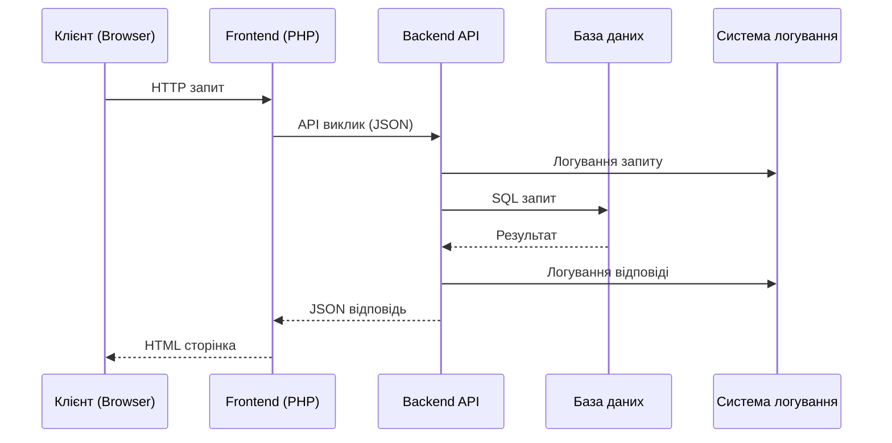
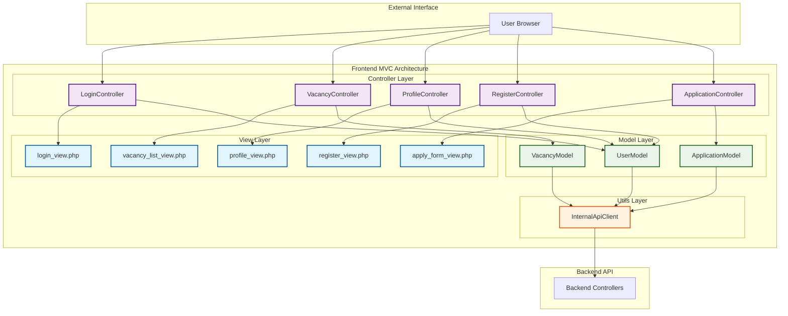

# SearchJob - Технічна документація проекту

## 📋 Опис проекту
SearchJob - це веб-платформа для пошуку роботи, що дозволяє кандидатам шукати вакансії, а роботодавцям - розміщувати оголошення про роботу.

## 🏗️ Архітектура системи
Проект реалізований з використанням:
- **Backend**: PHP з REST API
- **Frontend**: PHP MVC архітектура
- **База даних**: MySQL
- **Серіалізація**: JSON (основна) + XML (альтернативна)
- **Логування**: JSON структуровані логи

## 📚 Лабораторні роботи

### 🔧 [Лабораторна робота 1: Технічні вимоги та інфраструктура](Lab1_TechnicalRequirements.md)
- Аналіз вимог до проекту
- Дослідження конкурентів
- Технічні специфікації
- Інфраструктура розгортання

### 🌐 [Лабораторна робота 2: Клієнт-серверна архітектура](Lab2_ClientServer_Architecture.md)
**UML діаграма взаємодії:**

```mermaid
sequenceDiagram
    participant Client as Клієнт (Browser)
    participant Frontend as Frontend (PHP)
    participant Backend as Backend API
    participant DB as База даних
    participant Logger as Система логування

    Client->>Frontend: HTTP запит
    Frontend->>Backend: API виклик (JSON)
    Backend->>Logger: Логування запиту
    Backend->>DB: SQL запит
    DB-->>Backend: Результат
    Backend->>Logger: Логування відповіді
    Backend-->>Frontend: JSON відповідь
    Frontend-->>Client: HTML сторінка
```

### 🎨 [Лабораторна робота 3: Архітектура клієнтської частини](Lab3_ClientSide_Architecture.md)

**MVC Архітектура:**

```mermaid
graph TB
    subgraph "Frontend MVC Architecture"
        subgraph "View Layer"
            LV[login_view.php]
            VLV[vacancy_list_view.php]
            PV[profile_view.php]
            AFV[apply_form_view.php]
            RV[register_view.php]
        end
        
        subgraph "Controller Layer" 
            LC[LoginController]
            VC[VacancyController]
            PC[ProfileController]
            RC[RegisterController]
            AC[ApplicationController]
        end
        
        subgraph "Model Layer"
            UM[UserModel]
            VM[VacancyModel]
            AM[ApplicationModel]
        end
        
        subgraph "Utils Layer"
            IAC[InternalApiClient]
        end
    end
    
    subgraph "Backend API"
        API[Backend Controllers]
    end
    
    subgraph "External Interface"
        USER[User Browser]
    end
    
    %% Connections
    USER --> LC
    USER --> VC
    USER --> PC
    USER --> RC
    USER --> AC
    
    LC --> LV
    VC --> VLV
    PC --> PV
    RC --> RV
    AC --> AFV
    
    LC --> UM
    VC --> VM
    PC --> UM
    RC --> UM
    AC --> AM
    
    UM --> IAC
    VM --> IAC
    AM --> IAC
    IAC --> API
    
    %% Styling
    classDef viewClass fill:#e1f5fe,stroke:#01579b,stroke-width:2px
    classDef controllerClass fill:#f3e5f5,stroke:#4a148c,stroke-width:2px
    classDef modelClass fill:#e8f5e8,stroke:#1b5e20,stroke-width:2px
    classDef utilClass fill:#fff3e0,stroke:#e65100,stroke-width:2px
    
    class LV,VLV,PV,AFV,RV viewClass
    class LC,VC,PC,RC,AC controllerClass
    class UM,VM,AM modelClass
    class IAC utilClass
```

## 📁 Структура проекту

```
project/
├── Lab1_TechnicalRequirements.md    # Технічні вимоги
├── Lab2_ClientServer_Architecture.md # Клієнт-серверна архітектура  
├── Lab3_ClientSide_Architecture.md   # Клієнтська архітектура
├── webroot/searhjob/                 # Основний код проекту
│   ├── backend/                      # Серверна частина
│   │   ├── controllers/              # API контролери
│   │   ├── models/                   # Моделі даних
│   │   ├── utils/                    # Утиліти та логування
│   │   └── logs/                     # Файли логів
│   └── frontend/                     # Клієнтська частина
│       ├── controllers/              # MVC контролери
│       ├── models/                   # MVC моделі
│       ├── views/                    # MVC представлення
│       └── assets/                   # Статичні ресурси
└── nginx/                            # Конфігурація веб-сервера
```
