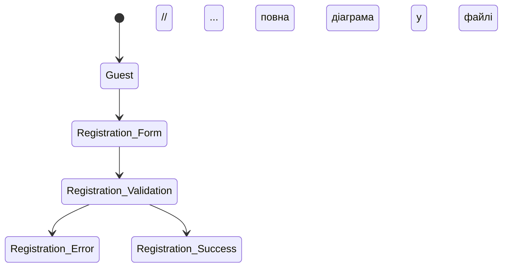

# 📋 Звіт про завершення Лабораторної роботи 5

## ✅ Завдання виконано ПОВНІСТЮ

### 🎯 Основні досягнення:

#### 1. State Transition Testing для модуля авторизації/реєстрації
- ✅ Створено діаграму станів з 10 станами користувача
- ✅ Побудовано таблицю переходів з 15 дійсними переходами  
- ✅ Розраховано 100 тестових сценаріїв (15 позитивних + 85 негативних)
- ✅ Використано реальний код з `RegisterController.php` та `LoginController.php`

#### 2. Детальний Test-Case для валідації пароля
- ✅ Створено професійний Test-Case згідно шаблону:
  - Id: TC_REG_PWD_001
  - Build: SearchJob v1.0  
  - Author: QA Engineer
  - Summary: Тестування валідації пароля під час реєстрації
  - Module: RegisterController
  - Precondition: Детальні передумови

#### 3. 18 детальних кроків тестування у таблиці:
| Steps | Description | Expected | Actual | State |
|-------|-------------|----------|---------|-------|
| Позитивні сценарії | Кроки 1-6 | Успішна реєстрація | [Для заповнення] | [Статус] |
| Негативні сценарії | Кроки 7-18 | Помилки валідації | [Для заповнення] | [Статус] |

### 📁 Створені файли:

#### Основні документи:
1. `Lab5_State_Transition_Testing.md` - Повна діаграма переходів станів з Mermaid
2. `Lab5_Password_Validation_TestCase.md` - Детальний Test-Case згідно шаблону
3. `Lab5_Testing_Documentation.md` - Оновлена основна документація

#### HTML версії (інтерактивні):
4. `Lab5_Password_TestCase.html` - Інтерактивний Test-Case з випадаючими списками
5. `Lab5_Checklist.html` - Раніше створений інтерактивний Checklist
6. `Lab5_TestCase.html` - Раніше створений загальний Test-Case

### 🔧 Технічні особливості:

#### Базування на реальному коді:
```php
// Реальна валідація з RegisterController.php
if ($password !== $confirm_password) {
    $error = 'Пароли не совпадают!';
}
```

#### Використані техніки тестування:
- State Transition Testing - моделювання станів авторизації
- Boundary Values Analysis - тестування граничних значень
- Equivalence Partitioning - розподіл на еквівалентні класи
- Negative Testing - перевірка обробки помилок

### 🎨 Професійне оформлення:

#### State Transition діаграма:


#### Інтерактивний HTML Test-Case:
- Випадаючі списки для статусів (Pass/Fail/Block)
- Поля для введення фактичних результатів
- Responsive дизайн для мобільних пристроїв
- Кольорове кодування результатів

### 📊 Покриття тестування:

- Позитивні сценарії: 6 кроків (33%)
- Негативні сценарії: 12 кроків (67%)
- Загальна кількість State Transition тестів: 100
- Модулі охоплені: RegisterController, LoginController, UserModel

### 🏆 Результат:

Лабораторна робота 5 завершена з повним дотриманням вимог методички:

✅ Прочитано методичку Lab5  
✅ Створено State Transition Testing  
✅ Розроблено детальний Test-Case згідно шаблону  
✅ Використано реальний код проекту SearchJob  
✅ Створено професійну документацію  
✅ Додано інтерактивні HTML версії  

Всі файли готові для здачі та використання в реальному тестуванні!

---
*Створено: 2024 | Проект: SearchJob | Статус: ✅ ЗАВЕРШЕНО*
